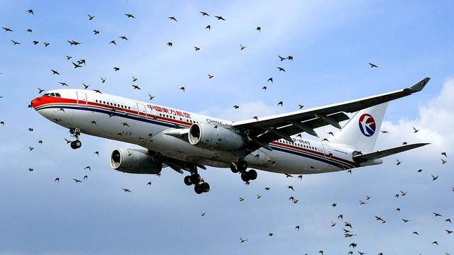

```{r setup, include=FALSE}
knitr::opts_chunk$set(
	echo = FALSE,
	message = FALSE,
	warning = FALSE
)
```

# Get some data

```{r echo=FALSE, message=FALSE, warning=FALSE}
library(fivethirtyeight)
data(package = "fivethirtyeight")
?airline_safety
```

## Briefly describe the dataset:

The airline_safety dataset contains 9 variables which indicate the 30-year period safety situation. The period is broke down into two halves: first from 1985 to 1999, and then from 2000 to 2014. The results indicate that there was no explicit correlation in crash rates from one half of the data set to the other. It implys that crash risk is not persistent — predictable to some extent based on the airline.

The link to the article is:
"Should Travelers Avoid Flying Airlines That Have Had Crashes in the Past?"
https://fivethirtyeight.com/features/should-travelers-avoid-flying-airlines-that-have-had-crashes-in-the-past/.

## Variables table of "airline_safety" dataset

 (Note: The table shows only a part of the variables)
 
```{r echo=FALSE, message=FALSE, warning=FALSE}
Name <- c('ASK/W', 'FA 85-99', 'F 00-14')
Description <- c('Available Seat Kilometers per week','Number of fatal accidents from 1985 to 1999','Nubmer of fatalities from 2000 to 2014')
Table <- data.frame(Name, Description)
Table[,c('Name', 'Description')]
```

# Show the data

## Summary of the data

```{r echo=FALSE, message=FALSE, warning=FALSE}
summary(airline_safety)
```

## An interactive table of the data

```{r message=FALSE, warning=FALSE}
library(DT)
datatable(airline_safety)
```

## A non-interactive table of the data

```{r echo=FALSE, message=FALSE, warning=FALSE}
subset_of_airline_safety <- airline_safety[1: 4,1: 4]
library(knitr)
kable(subset_of_airline_safety)
```

# Add some Latex formulas

The author takes crash rates on the basis of the number of available seat kilometers (ASKs), which is defined as the number of seats multiplied by the number of kilometers the airline flies.

The fomula is as below:

$$Number of seats = ASK/number of kilometers the airline flies$$

In this case, one could argue for a different definition of risk — for instance, based on the number of takeoffs and landings, since relatively few crashes occur in the cruise phase of flight. That data is hard to find for international carriers, however, whereas ASKs are more commonly reported in the industry.


# Add a scatter plot

```{r echo=FALSE, message=FALSE, warning=FALSE}
library(ggplot2)
length(airline_safety)
qplot(incidents_85_99,incidents_00_14,data=airline_safety)
p <- qplot(incidents_85_99,incidents_00_14,data=airline_safety)
p+geom_point()+stat_smooth()+ggtitle('Incidents by Airline are Slightly Predictable')+
  labs(x="Incidents 1985-99",y="Incidents 2000-14")
```

# Add a picture

I am lost in the homework just like the plane in the birds:( 

```{r echo=FALSE, message=FALSE, warning=FALSE}

```


# Add a footnote 

In fact, if you want to predict an airline’s future rate of crashes, you’re best off looking at its home country’s GDP and largely ignoring its track record.[^1]

[^1]: For instance, if you conduct a regression on an airline’s safety score from 2000-2014 on the basis of its safety score from 1985-1999 and the natural logarithm of its GDP in 1999, the GDP variable is highly statistically significant while its past safety score provides no additional predictive power.


# Add a Blockquote

An expert said:

> The downing of Malaysia Airlines Flight 17 in Ukraine on Thursday, following the disappearance of its Flight 370 in March, is the second mysterious incident involving the airline this year. The incidents don’t appear to be related, but that isn’t preventing people from insisting that they’ll never fly Malaysia Airlines again. 


