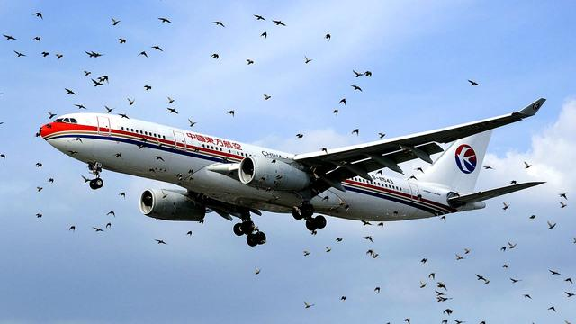

# Get some data


## Briefly describe the dataset:

The airline_safety dataset contains 9 variables which indicate the 30-year period safety situation. The period is broke down into two halves: first from 1985 to 1999, and then from 2000 to 2014. The results indicate that there was no explicit correlation in crash rates from one half of the data set to the other. It implys that crash risk is not persistent — predictable to some extent based on the airline.

The link to the article is:
"Should Travelers Avoid Flying Airlines That Have Had Crashes in the Past?"
https://fivethirtyeight.com/features/should-travelers-avoid-flying-airlines-that-have-had-crashes-in-the-past/.

## Variables table of "airline_safety" dataset

 (Note: The table shows only a part of the variables)
 

```
##       Name                                 Description
## 1    ASK/W          Available Seat Kilometers per week
## 2 FA 85-99 Number of fatal accidents from 1985 to 1999
## 3  F 00-14      Nubmer of fatalities from 2000 to 2014
```

# Show the data

## Summary of the data


```
##    airline          incl_reg_subsidiaries avail_seat_km_per_week
##  Length:56          Mode :logical         Min.   :2.594e+08     
##  Class :character   FALSE:40              1st Qu.:4.740e+08     
##  Mode  :character   TRUE :16              Median :8.029e+08     
##                                           Mean   :1.385e+09     
##                                           3rd Qu.:1.847e+09     
##                                           Max.   :7.139e+09     
##  incidents_85_99  fatal_accidents_85_99 fatalities_85_99 incidents_00_14 
##  Min.   : 0.000   Min.   : 0.000        Min.   :  0.0    Min.   : 0.000  
##  1st Qu.: 2.000   1st Qu.: 0.000        1st Qu.:  0.0    1st Qu.: 1.000  
##  Median : 4.000   Median : 1.000        Median : 48.5    Median : 3.000  
##  Mean   : 7.179   Mean   : 2.179        Mean   :112.4    Mean   : 4.125  
##  3rd Qu.: 8.000   3rd Qu.: 3.000        3rd Qu.:184.2    3rd Qu.: 5.250  
##  Max.   :76.000   Max.   :14.000        Max.   :535.0    Max.   :24.000  
##  fatal_accidents_00_14 fatalities_00_14
##  Min.   :0.0000        Min.   :  0.00  
##  1st Qu.:0.0000        1st Qu.:  0.00  
##  Median :0.0000        Median :  0.00  
##  Mean   :0.6607        Mean   : 55.52  
##  3rd Qu.:1.0000        3rd Qu.: 83.25  
##  Max.   :3.0000        Max.   :537.00
```

## An interactive table of the data

<!--html_preserve--><div id="htmlwidget-18d5177250bab4350f6d" style="width:100%;height:auto;" class="datatables html-widget"></div>
<script type="application/json" data-for="htmlwidget-18d5177250bab4350f6d">{"x":{"filter":"none","data":[["1","2","3","4","5","6","7","8","9","10","11","12","13","14","15","16","17","18","19","20","21","22","23","24","25","26","27","28","29","30","31","32","33","34","35","36","37","38","39","40","41","42","43","44","45","46","47","48","49","50","51","52","53","54","55","56"],["Aer Lingus","Aeroflot","Aerolineas Argentinas","Aeromexico","Air Canada","Air France","Air India","Air New Zealand","Alaska Airlines","Alitalia","All Nippon Airways","American","Austrian Airlines","Avianca","British Airways","Cathay Pacific","China Airlines","Condor","COPA","Delta / Northwest","Egyptair","El Al","Ethiopian Airlines","Finnair","Garuda Indonesia","Gulf Air","Hawaiian Airlines","Iberia","Japan Airlines","Kenya Airways","KLM","Korean Air","LAN Airlines","Lufthansa","Malaysia Airlines","Pakistan International","Philippine Airlines","Qantas","Royal Air Maroc","SAS","Saudi Arabian","Singapore Airlines","South African","Southwest Airlines","Sri Lankan / AirLanka","SWISS","TACA","TAM","TAP - Air Portugal","Thai Airways","Turkish Airlines","United / Continental","US Airways / America West","Vietnam Airlines","Virgin Atlantic","Xiamen Airlines"],[false,true,false,true,false,false,true,true,true,false,false,true,false,false,true,true,false,false,false,true,false,false,false,false,false,false,false,false,false,false,true,false,false,true,false,false,false,true,false,true,false,false,false,false,false,true,false,false,false,false,false,true,true,false,false,false],[320906734,1197672318,385803648,596871813,1865253802,3004002661,869253552,710174817,965346773,698012498,1841234177,5228357340,358239823,396922563,3179760952,2582459303,813216487,417982610,550491507,6525658894,557699891,335448023,488560643,506464950,613356665,301379762,493877795,1173203126,1574217531,277414794,1874561773,1734522605,1001965891,3426529504,1039171244,348563137,413007158,1917428984,295705339,682971852,859673901,2376857805,651502442,3276525770,325582976,792601299,259373346,1509195646,619130754,1702802250,1946098294,7139291291,2455687887,625084918,1005248585,430462962],[2,76,6,3,2,14,2,3,5,7,3,21,1,5,4,0,12,2,3,24,8,1,25,1,10,1,0,4,3,2,7,12,3,6,3,8,7,1,5,5,7,2,2,1,2,2,3,8,0,8,8,19,16,7,1,9],[0,14,0,1,0,4,1,0,0,2,1,5,0,3,0,0,6,1,1,12,3,1,5,0,3,0,0,1,1,0,1,5,2,1,1,3,4,0,3,0,2,2,1,0,1,1,1,3,0,4,3,8,7,3,0,1],[0,128,0,64,0,79,329,0,0,50,1,101,0,323,0,0,535,16,47,407,282,4,167,0,260,0,0,148,520,0,3,425,21,2,34,234,74,0,51,0,313,6,159,0,14,229,3,98,0,308,64,319,224,171,0,82],[0,6,1,5,2,6,4,5,5,4,7,17,1,0,6,2,2,0,0,24,4,1,5,0,4,3,1,5,0,2,1,1,0,3,3,10,2,5,3,6,11,2,1,8,4,3,1,7,0,2,8,14,11,1,0,2],[0,1,0,0,0,2,1,1,1,0,0,3,0,0,0,0,1,0,0,2,1,0,2,0,2,1,0,0,0,2,0,0,0,0,2,2,1,0,0,1,0,1,0,0,0,0,1,2,0,1,2,2,2,0,0,0],[0,88,0,0,0,337,158,7,88,0,0,416,0,0,0,0,225,0,0,51,14,0,92,0,22,143,0,0,0,283,0,0,0,0,537,46,1,0,0,110,0,83,0,0,0,0,3,188,0,1,84,109,23,0,0,0]],"container":"<table class=\"display\">\n  <thead>\n    <tr>\n      <th> <\/th>\n      <th>airline<\/th>\n      <th>incl_reg_subsidiaries<\/th>\n      <th>avail_seat_km_per_week<\/th>\n      <th>incidents_85_99<\/th>\n      <th>fatal_accidents_85_99<\/th>\n      <th>fatalities_85_99<\/th>\n      <th>incidents_00_14<\/th>\n      <th>fatal_accidents_00_14<\/th>\n      <th>fatalities_00_14<\/th>\n    <\/tr>\n  <\/thead>\n<\/table>","options":{"columnDefs":[{"className":"dt-right","targets":[3,4,5,6,7,8,9]},{"orderable":false,"targets":0}],"order":[],"autoWidth":false,"orderClasses":false}},"evals":[],"jsHooks":[]}</script><!--/html_preserve-->

## A non-interactive table of the data


airline                 incl_reg_subsidiaries    avail_seat_km_per_week   incidents_85_99
----------------------  ----------------------  -----------------------  ----------------
Aer Lingus              FALSE                                 320906734                 2
Aeroflot                TRUE                                 1197672318                76
Aerolineas Argentinas   FALSE                                 385803648                 6
Aeromexico              TRUE                                  596871813                 3

# Add some Latex formulas

The author takes crash rates on the basis of the number of available seat kilometers (ASKs), which is defined as the number of seats multiplied by the number of kilometers the airline flies.

The fomula is as below:

$$Number of seats = ASK/number of kilometers the airline flies$$

In this case, one could argue for a different definition of risk — for instance, based on the number of takeoffs and landings, since relatively few crashes occur in the cruise phase of flight. That data is hard to find for international carriers, however, whereas ASKs are more commonly reported in the industry.


# Add a scatter plot


```
## [1] 9
```

<!-- --><!-- -->

# Add a picture

I am lost in the homework just like the plane in the birds:( 

<!-- -->


# Add a footnote 

In fact, if you want to predict an airline’s future rate of crashes, you’re best off looking at its home country’s GDP and largely ignoring its track record.[^1]

[^1]: For instance, if you conduct a regression on an airline’s safety score from 2000-2014 on the basis of its safety score from 1985-1999 and the natural logarithm of its GDP in 1999, the GDP variable is highly statistically significant while its past safety score provides no additional predictive power.


# Add a Blockquote

An expert said:

> The downing of Malaysia Airlines Flight 17 in Ukraine on Thursday, following the disappearance of its Flight 370 in March, is the second mysterious incident involving the airline this year. The incidents don’t appear to be related, but that isn’t preventing people from insisting that they’ll never fly Malaysia Airlines again. 


