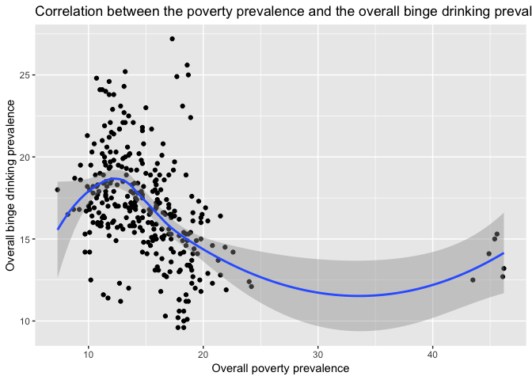

# Selection of Data and Tidying 


```
## ─ Attaching packages ────────────────────────────────────────────────── tidyverse 1.2.1 ─
```

```
## ✔ ggplot2 3.0.0     ✔ purrr   0.2.5
## ✔ tibble  1.4.2     ✔ dplyr   0.7.6
## ✔ tidyr   0.8.1     ✔ stringr 1.3.1
## ✔ readr   1.1.1     ✔ forcats 0.3.0
```

```
## ─ Conflicts ─────────────────────────────────────────────────── tidyverse_conflicts() ─
## ✖ dplyr::filter() masks stats::filter()
## ✖ dplyr::lag()    masks stats::lag()
```

```
##           state year DataValue Stratification1
## 1 United States 2016      16.9         Overall
## 2       Alabama 2016        13         Overall
## 3        Alaska 2016      18.2         Overall
## 4       Arizona 2016      15.6         Overall
## 5      Arkansas 2016        15         Overall
## 6    California 2016      16.3         Overall
```


```
##           state stateabb year DataValue Stratification1
## 1 United States       US 2014      15.5         Overall
## 2        Alaska       AK 2015      10.3         Overall
## 3       Alabama       AL 2015      18.5         Overall
## 4      Arkansas       AR 2015      19.1         Overall
## 5       Arizona       AZ 2015      17.4         Overall
## 6    California       CA 2015      15.3         Overall
```

## Cleaned dataset in a tidy state-year format


```
##     state_year stateabb Overall.x Female Male Overall.y
## 1 Alabama_2010       AL        19   <NA> <NA>      <NA>
## 2 Alabama_2011       AL        19    7.9 20.2      13.7
## 3 Alabama_2012       AL        19      7 18.2      12.3
## 4 Alabama_2013       AL      18.7    6.5 16.3      11.2
## 5 Alabama_2014       AL      19.3    6.8 17.9        12
## 6 Alabama_2015       AL      18.5    7.5 16.2      11.6
```

```
##                    state stateabb year binge_all binge_male binge_female
## 1                Alabama       AL 2010        NA         NA           NA
## 2                Alabama       AL 2011      13.7       20.2          7.9
## 3                Alabama       AL 2012      12.3       18.2          7.0
## 4                Alabama       AL 2013      11.2       16.3          6.5
## 5                Alabama       AL 2014      12.0       17.9          6.8
## 6                Alabama       AL 2015      11.6       16.2          7.5
## 7                Alabama       AL 2016      13.0       17.6          8.8
## 8                 Alaska       AK 2010        NA         NA           NA
## 9                 Alaska       AK 2011      20.8       26.0         15.6
## 10                Alaska       AK 2012      16.8       20.5         12.7
## 11                Alaska       AK 2013      19.5       23.8         14.8
## 12                Alaska       AK 2014      20.2       25.3         14.8
## 13                Alaska       AK 2015      20.3       23.9         16.4
## 14                Alaska       AK 2016      18.2       21.0         15.1
## 15               Arizona       AZ 2010        NA         NA           NA
## 16               Arizona       AZ 2011      17.6       23.6         11.7
## 17               Arizona       AZ 2012      15.3       21.1          9.7
## 18               Arizona       AZ 2013      13.4       18.0          9.1
## 19               Arizona       AZ 2014      14.9       21.1          9.1
## 20               Arizona       AZ 2015      14.2       20.3          8.3
## 21               Arizona       AZ 2016      15.6       21.3         10.1
## 22              Arkansas       AR 2010        NA         NA           NA
## 23              Arkansas       AR 2011      14.1       19.2          9.2
## 24              Arkansas       AR 2012      11.8       16.3          7.7
## 25              Arkansas       AR 2013      12.5       17.5          8.0
## 26              Arkansas       AR 2014      13.3       17.9          8.9
## 27              Arkansas       AR 2015      14.1       19.8          8.8
## 28              Arkansas       AR 2016      15.0       20.6          9.8
## 29            California       CA 2010        NA         NA           NA
## 30            California       CA 2011      18.6       25.2         12.1
## 31            California       CA 2012      16.9       23.2         10.9
## 32            California       CA 2013      17.4       23.3         11.9
## 33            California       CA 2014      15.6       20.3         11.1
## 34            California       CA 2015      16.5       21.4         11.7
## 35            California       CA 2016      16.3       21.5         11.2
## 36              Colorado       CO 2010        NA         NA           NA
## 37              Colorado       CO 2011      20.1       26.3         14.0
## 38              Colorado       CO 2012      19.2       24.7         13.8
## 39              Colorado       CO 2013      18.5       23.6         13.5
## 40              Colorado       CO 2014      17.5       22.8         12.2
## 41              Colorado       CO 2015      17.6       23.0         12.4
## 42              Colorado       CO 2016      19.0       24.2         13.9
## 43           Connecticut       CT 2010        NA         NA           NA
## 44           Connecticut       CT 2011      17.9       24.4         11.9
## 45           Connecticut       CT 2012      17.5       22.9         12.6
## 46           Connecticut       CT 2013      18.2       24.3         12.5
## 47           Connecticut       CT 2014      15.9       20.8         11.3
## 48           Connecticut       CT 2015      16.9       23.1         11.1
## 49           Connecticut       CT 2016      16.7       21.9         11.9
## 50              Delaware       DE 2010        NA         NA           NA
## 51              Delaware       DE 2011      20.3       27.2         13.9
## 52              Delaware       DE 2012      18.6       23.6         14.0
## 53              Delaware       DE 2013      17.0       22.4         12.0
## 54              Delaware       DE 2014      15.7       21.0         10.8
## 55              Delaware       DE 2015      14.9       17.8         12.4
## 56              Delaware       DE 2016      17.0       20.6         13.7
## 57  District of Columbia       DC 2010        NA         NA           NA
## 58  District of Columbia       DC 2011      25.0       31.3         19.5
## 59  District of Columbia       DC 2012      23.1       27.2         19.6
## 60  District of Columbia       DC 2013      22.4       28.2         17.1
## 61  District of Columbia       DC 2014      24.9       31.2         19.4
## 62  District of Columbia       DC 2015      27.2       33.1         21.9
## 63  District of Columbia       DC 2016      25.6       30.5         21.3
## 64               Florida       FL 2010        NA         NA           NA
## 65               Florida       FL 2011      17.1       22.6         12.0
## 66               Florida       FL 2012      16.5       22.1         11.4
## 67               Florida       FL 2013      15.6       21.7          9.9
## 68               Florida       FL 2014      15.0       19.8         10.6
## 69               Florida       FL 2015      15.6       20.5         11.0
## 70               Florida       FL 2016      15.5       20.1         11.3
## 71               Georgia       GA 2010        NA         NA           NA
## 72               Georgia       GA 2011      16.6       22.5         11.1
## 73               Georgia       GA 2012      14.4       19.4          9.8
## 74               Georgia       GA 2013      13.1       17.3          9.2
## 75               Georgia       GA 2014      14.2       19.6          9.2
## 76               Georgia       GA 2015      15.3       20.8         10.2
## 77               Georgia       GA 2016      13.3       17.4          9.7
## 78                Hawaii       HI 2010        NA         NA           NA
## 79                Hawaii       HI 2011      21.5       30.8         12.3
## 80                Hawaii       HI 2012      18.2       25.7         11.0
## 81                Hawaii       HI 2013      18.3       25.4         11.2
## 82                Hawaii       HI 2014      19.7       28.0         11.4
## 83                Hawaii       HI 2015      18.9       26.1         11.7
## 84                Hawaii       HI 2016      18.6       24.3         12.8
## 85                 Idaho       ID 2010        NA         NA           NA
## 86                 Idaho       ID 2011      16.6       22.0         11.2
## 87                 Idaho       ID 2012      14.1       17.9         10.5
## 88                 Idaho       ID 2013      14.9       18.9         10.9
## 89                 Idaho       ID 2014      14.8       20.8          9.1
## 90                 Idaho       ID 2015      14.1       18.6          9.8
## 91                 Idaho       ID 2016      16.1       20.3         12.0
## 92              Illinois       IL 2010        NA         NA           NA
## 93              Illinois       IL 2011      23.0       30.2         16.1
## 94              Illinois       IL 2012      21.6       29.0         14.6
## 95              Illinois       IL 2013      21.8       28.4         15.5
## 96              Illinois       IL 2014      20.2       27.5         13.3
## 97              Illinois       IL 2015      20.2       26.4         14.4
## 98              Illinois       IL 2016      19.9       25.6         14.5
## 99               Indiana       IN 2010        NA         NA           NA
## 100              Indiana       IN 2011      17.8       23.4         12.5
## 101              Indiana       IN 2012      15.9       21.6         10.6
## 102              Indiana       IN 2013      15.0       20.2         10.3
## 103              Indiana       IN 2014      14.8       19.9         10.0
## 104              Indiana       IN 2015      15.7       22.0          9.8
## 105              Indiana       IN 2016      17.5       23.3         12.1
## 106                 Iowa       IA 2010        NA         NA           NA
## 107                 Iowa       IA 2011      23.1       30.8         15.8
## 108                 Iowa       IA 2012      21.7       28.5         15.2
## 109                 Iowa       IA 2013      21.7       28.5         15.1
## 110                 Iowa       IA 2014      21.4       27.9         15.1
## 111                 Iowa       IA 2015      19.8       26.6         13.3
## 112                 Iowa       IA 2016      21.2       27.1         15.4
## 113               Kansas       KS 2010        NA         NA           NA
## 114               Kansas       KS 2011      17.0       23.1         11.2
## 115               Kansas       KS 2012      15.8       22.3          9.5
## 116               Kansas       KS 2013      15.4       21.7          9.3
## 117               Kansas       KS 2014      15.8       22.8          9.1
## 118               Kansas       KS 2015      15.6       21.4         10.1
## 119               Kansas       KS 2016      16.0       21.8         10.4
## 120             Kentucky       KY 2010        NA         NA           NA
## 121             Kentucky       KY 2011      16.1       22.6         10.2
## 122             Kentucky       KY 2012      14.9       21.0          9.1
## 123             Kentucky       KY 2013      13.4       18.5          8.6
## 124             Kentucky       KY 2014      12.7       18.1          7.6
## 125             Kentucky       KY 2015      15.3       21.4          9.6
## 126             Kentucky       KY 2016      14.6       20.5          9.2
## 127            Louisiana       LA 2010        NA         NA           NA
## 128            Louisiana       LA 2011      16.1       22.7         10.2
## 129            Louisiana       LA 2012      16.5       24.1          9.7
## 130            Louisiana       LA 2013      16.3       22.0         11.1
## 131            Louisiana       LA 2014      16.0       21.4         11.1
## 132            Louisiana       LA 2015      17.3       22.8         12.2
## 133            Louisiana       LA 2016      16.9       22.4         11.7
## 134                Maine       ME 2010        NA         NA           NA
## 135                Maine       ME 2011      17.3       22.9         11.9
## 136                Maine       ME 2012      17.7       24.0         11.9
## 137                Maine       ME 2013      17.2       22.2         12.5
## 138                Maine       ME 2014      17.0       23.0         11.5
## 139                Maine       ME 2015      17.6       22.6         13.0
## 140                Maine       ME 2016      18.3       23.4         13.6
## 141             Maryland       MD 2010        NA         NA           NA
## 142             Maryland       MD 2011      18.0       23.0         13.4
## 143             Maryland       MD 2012      16.4       21.7         11.7
## 144             Maryland       MD 2013      14.2       18.9         10.1
## 145             Maryland       MD 2014      15.4       19.8         11.5
## 146             Maryland       MD 2015      14.2       17.9         10.8
## 147             Maryland       MD 2016      15.3       19.5         11.4
## 148        Massachusetts       MA 2010        NA         NA           NA
## 149        Massachusetts       MA 2011      20.6       25.4         16.1
## 150        Massachusetts       MA 2012      19.7       25.6         14.4
## 151        Massachusetts       MA 2013      19.4       25.5         13.8
## 152        Massachusetts       MA 2014      17.4       23.0         12.4
## 153        Massachusetts       MA 2015      17.7       23.3         12.7
## 154        Massachusetts       MA 2016      17.8       22.3         13.8
## 155             Michigan       MI 2010        NA         NA           NA
## 156             Michigan       MI 2011      19.7       27.3         12.7
## 157             Michigan       MI 2012      19.2       24.7         14.0
## 158             Michigan       MI 2013      18.9       24.1         13.9
## 159             Michigan       MI 2014      18.9       24.0         14.3
## 160             Michigan       MI 2015      18.5       24.5         12.9
## 161             Michigan       MI 2016      19.0       24.0         14.4
## 162            Minnesota       MN 2010        NA         NA           NA
## 163            Minnesota       MN 2011      22.1       29.1         15.5
## 164            Minnesota       MN 2012      21.9       28.5         15.5
## 165            Minnesota       MN 2013      21.0       27.0         15.1
## 166            Minnesota       MN 2014      19.5       24.6         14.8
## 167            Minnesota       MN 2015      19.5       25.2         14.0
## 168            Minnesota       MN 2016      21.3       26.5         16.2
## 169          Mississippi       MS 2010        NA         NA           NA
## 170          Mississippi       MS 2011      14.2       21.6          7.8
## 171          Mississippi       MS 2012      12.1       17.9          7.0
## 172          Mississippi       MS 2013      12.4       16.5          8.7
## 173          Mississippi       MS 2014      12.8       18.5          7.6
## 174          Mississippi       MS 2015      11.9       18.1          6.2
## 175          Mississippi       MS 2016      12.3       18.0          7.1
## 176             Missouri       MO 2010        NA         NA           NA
## 177             Missouri       MO 2011      19.2       26.1         12.9
## 178             Missouri       MO 2012      17.2       23.5         11.5
## 179             Missouri       MO 2013      17.2       23.5         11.3
## 180             Missouri       MO 2014      15.1       20.7          9.8
## 181             Missouri       MO 2015      16.7       22.0         11.6
## 182             Missouri       MO 2016      18.4       23.6         13.5
## 183              Montana       MT 2010        NA         NA           NA
## 184              Montana       MT 2011      20.8       27.3         14.5
## 185              Montana       MT 2012      21.7       27.3         16.3
## 186              Montana       MT 2013      20.8       27.3         14.3
## 187              Montana       MT 2014      18.9       25.3         12.5
## 188              Montana       MT 2015      19.8       26.5         13.2
## 189              Montana       MT 2016      18.9       24.9         13.0
## 190             Nebraska       NE 2010        NA         NA           NA
## 191             Nebraska       NE 2011      22.7       30.2         15.7
## 192             Nebraska       NE 2012      22.1       29.1         15.5
## 193             Nebraska       NE 2013      20.0       25.2         15.0
## 194             Nebraska       NE 2014      20.3       26.8         14.1
## 195             Nebraska       NE 2015      19.5       26.0         13.1
## 196             Nebraska       NE 2016      20.0       27.2         13.1
## 197               Nevada       NV 2010        NA         NA           NA
## 198               Nevada       NV 2011      18.6       23.9         13.2
## 199               Nevada       NV 2012      15.1       20.7          9.4
## 200               Nevada       NV 2013      15.2       21.1          9.2
## 201               Nevada       NV 2014      16.0       21.6         10.4
## 202               Nevada       NV 2015      14.2       20.2          8.4
## 203               Nevada       NV 2016      15.8       20.0         11.7
## 204        New Hampshire       NH 2010        NA         NA           NA
## 205        New Hampshire       NH 2011      18.7       24.7         12.9
## 206        New Hampshire       NH 2012      17.0       22.0         12.3
## 207        New Hampshire       NH 2013      16.8       21.7         12.2
## 208        New Hampshire       NH 2014      16.8       21.6         12.4
## 209        New Hampshire       NH 2015      16.5       21.5         11.8
## 210        New Hampshire       NH 2016      18.0       23.1         13.2
## 211           New Jersey       NJ 2010        NA         NA           NA
## 212           New Jersey       NJ 2011      18.2       24.1         12.7
## 213           New Jersey       NJ 2012      17.7       23.8         12.1
## 214           New Jersey       NJ 2013      16.3       21.5         11.6
## 215           New Jersey       NJ 2014      15.8       20.5         11.6
## 216           New Jersey       NJ 2015      16.0       20.9         11.6
## 217           New Jersey       NJ 2016      16.0       20.3         12.0
## 218           New Mexico       NM 2010        NA         NA           NA
## 219           New Mexico       NM 2011      16.4       23.0         10.1
## 220           New Mexico       NM 2012      14.6       20.3          9.2
## 221           New Mexico       NM 2013      14.5       20.1          9.1
## 222           New Mexico       NM 2014      13.7       20.5          7.4
## 223           New Mexico       NM 2015      12.9       17.4          8.6
## 224           New Mexico       NM 2016      15.0       20.8          9.5
## 225             New York       NY 2010        NA         NA           NA
## 226             New York       NY 2011      19.6       25.1         14.4
## 227             New York       NY 2012      17.0       23.3         11.2
## 228             New York       NY 2013      17.4       23.3         12.1
## 229             New York       NY 2014      15.0       18.4         11.9
## 230             New York       NY 2015      16.7       22.0         11.9
## 231             New York       NY 2016      17.5       22.7         12.8
## 232       North Carolina       NC 2010        NA         NA           NA
## 233       North Carolina       NC 2011      15.2       21.3          9.7
## 234       North Carolina       NC 2012      13.1       18.5          8.2
## 235       North Carolina       NC 2013      13.0       17.9          8.6
## 236       North Carolina       NC 2014      13.6       19.6          8.3
## 237       North Carolina       NC 2015      13.8       18.8          9.3
## 238       North Carolina       NC 2016      14.6       18.9         10.7
## 239         North Dakota       ND 2010        NA         NA           NA
## 240         North Dakota       ND 2011      23.8       31.3         16.4
## 241         North Dakota       ND 2012      24.1       30.0         18.1
## 242         North Dakota       ND 2013      23.8       32.2         15.5
## 243         North Dakota       ND 2014      24.0       29.9         17.8
## 244         North Dakota       ND 2015      24.1       31.0         16.9
## 245         North Dakota       ND 2016      24.8       32.1         17.2
## 246                 Ohio       OH 2010        NA         NA           NA
## 247                 Ohio       OH 2011      20.1       26.6         14.0
## 248                 Ohio       OH 2012      18.0       23.5         13.0
## 249                 Ohio       OH 2013      17.1       22.5         12.1
## 250                 Ohio       OH 2014      18.0       24.1         12.5
## 251                 Ohio       OH 2015      18.2       24.0         12.9
## 252                 Ohio       OH 2016      17.9       23.5         12.8
## 253             Oklahoma       OK 2010        NA         NA           NA
## 254             Oklahoma       OK 2011      16.5       24.2          9.3
## 255             Oklahoma       OK 2012      14.4       19.7          9.3
## 256             Oklahoma       OK 2013      12.7       17.7          7.9
## 257             Oklahoma       OK 2014      12.8       18.6          7.4
## 258             Oklahoma       OK 2015      13.1       18.0          8.6
## 259             Oklahoma       OK 2016      11.8       16.3          7.7
## 260               Oregon       OR 2010        NA         NA           NA
## 261               Oregon       OR 2011      16.4       21.4         11.7
## 262               Oregon       OR 2012      15.3       20.2         10.7
## 263               Oregon       OR 2013      16.5       20.8         12.4
## 264               Oregon       OR 2014      16.6       20.8         12.6
## 265               Oregon       OR 2015      16.6       20.3         13.1
## 266               Oregon       OR 2016      16.3       20.8         11.9
## 267         Pennsylvania       PA 2010        NA         NA           NA
## 268         Pennsylvania       PA 2011      18.3       24.1         13.0
## 269         Pennsylvania       PA 2012      17.9       23.6         12.6
## 270         Pennsylvania       PA 2013      17.2       24.2         10.7
## 271         Pennsylvania       PA 2014      16.7       23.2         10.6
## 272         Pennsylvania       PA 2015      17.0       22.6         11.7
## 273         Pennsylvania       PA 2016      19.4       25.3         13.8
## 274          Puerto Rico       PR 2010        NA         NA           NA
## 275          Puerto Rico       PR 2011      15.3       24.1          7.8
## 276          Puerto Rico       PR 2012      14.1       21.8          7.6
## 277          Puerto Rico       PR 2013      15.0       23.6          7.5
## 278          Puerto Rico       PR 2014      13.2       18.8          8.5
## 279          Puerto Rico       PR 2015      12.7       20.1          6.4
## 280          Puerto Rico       PR 2016      12.5       18.1          7.7
## 281         Rhode Island       RI 2010        NA         NA           NA
## 282         Rhode Island       RI 2011      19.6       27.0         13.1
## 283         Rhode Island       RI 2012      17.2       22.6         12.3
## 284         Rhode Island       RI 2013      17.8       23.4         12.7
## 285         Rhode Island       RI 2014      18.4       25.2         12.1
## 286         Rhode Island       RI 2015      16.0       21.0         11.4
## 287         Rhode Island       RI 2016      15.8       21.0         11.1
## 288       South Carolina       SC 2010        NA         NA           NA
## 289       South Carolina       SC 2011      15.4       21.8          9.7
## 290       South Carolina       SC 2012      15.4       21.8          9.6
## 291       South Carolina       SC 2013      14.9       21.2          9.3
## 292       South Carolina       SC 2014      14.1       19.7          9.0
## 293       South Carolina       SC 2015      15.2       20.9         10.1
## 294       South Carolina       SC 2016      16.8       22.9         11.3
## 295         South Dakota       SD 2010        NA         NA           NA
## 296         South Dakota       SD 2011      22.1       28.7         15.7
## 297         South Dakota       SD 2012      20.6       27.4         13.9
## 298         South Dakota       SD 2013      19.2       25.0         13.5
## 299         South Dakota       SD 2014      17.4       22.9         12.1
## 300         South Dakota       SD 2015      16.9       21.9         12.0
## 301         South Dakota       SD 2016      19.3       24.3         14.3
## 302            Tennessee       TN 2010        NA         NA           NA
## 303            Tennessee       TN 2011      10.0       15.1          5.6
## 304            Tennessee       TN 2012      11.3       16.6          6.5
## 305            Tennessee       TN 2013       9.6       13.1          6.5
## 306            Tennessee       TN 2014      10.6       15.7          5.9
## 307            Tennessee       TN 2015      10.3       14.0          7.0
## 308            Tennessee       TN 2016      13.1       16.6          9.8
## 309                Texas       TX 2010        NA         NA           NA
## 310                Texas       TX 2011      18.9       26.3         11.7
## 311                Texas       TX 2012      16.2       24.1          8.8
## 312                Texas       TX 2013      16.7       23.5         10.2
## 313                Texas       TX 2014      16.3       22.1         10.8
## 314                Texas       TX 2015      15.9       22.2          9.9
## 315                Texas       TX 2016      17.9       24.4         11.7
## 316        United States       US 2010        NA         NA           NA
## 317        United States       US 2011      18.3       24.2         12.6
## 318        United States       US 2012      16.9       22.9         11.4
## 319        United States       US 2013      16.8       22.2         11.3
## 320        United States       US 2014      16.0       21.4         11.1
## 321        United States       US 2015      16.3       21.4         11.7
## 322        United States       US 2016      16.9       21.9         12.0
## 323                 Utah       UT 2010        NA         NA           NA
## 324                 Utah       UT 2011      12.0       17.0          7.0
## 325                 Utah       UT 2012      11.2       15.2          7.2
## 326                 Utah       UT 2013      12.3       16.2          8.5
## 327                 Utah       UT 2014      11.4       15.3          7.5
## 328                 Utah       UT 2015      11.6       15.5          7.8
## 329                 Utah       UT 2016      12.5       16.7          8.3
## 330              Vermont       VT 2010        NA         NA           NA
## 331              Vermont       VT 2011      18.5       24.6         12.6
## 332              Vermont       VT 2012      19.3       25.1         14.0
## 333              Vermont       VT 2013      17.1       22.5         12.1
## 334              Vermont       VT 2014      17.9       23.5         12.7
## 335              Vermont       VT 2015      17.2       22.5         12.2
## 336              Vermont       VT 2016      18.4       23.3         13.8
## 337             Virginia       VA 2010        NA         NA           NA
## 338             Virginia       VA 2011      17.9       22.5         13.6
## 339             Virginia       VA 2012      15.7       20.5         11.2
## 340             Virginia       VA 2013      15.9       22.0         10.3
## 341             Virginia       VA 2014      15.2       20.0         10.7
## 342             Virginia       VA 2015      16.3       20.7         12.3
## 343             Virginia       VA 2016      15.8       20.2         11.8
## 344           Washington       WA 2010        NA         NA           NA
## 345           Washington       WA 2011      17.8       21.9         13.6
## 346           Washington       WA 2012      16.9       21.7         12.3
## 347           Washington       WA 2013      16.8       21.3         12.4
## 348           Washington       WA 2014      17.1       22.4         11.9
## 349           Washington       WA 2015      16.1       19.4         12.9
## 350           Washington       WA 2016      16.4       20.7         12.2
## 351        West Virginia       WV 2010        NA         NA           NA
## 352        West Virginia       WV 2011      10.1       15.5          5.2
## 353        West Virginia       WV 2012      10.2       15.5          5.1
## 354        West Virginia       WV 2013      11.2       15.9          6.7
## 355        West Virginia       WV 2014       9.6       14.5          5.0
## 356        West Virginia       WV 2015      10.6       16.5          5.0
## 357        West Virginia       WV 2016      11.3       16.8          6.2
## 358            Wisconsin       WI 2010        NA         NA           NA
## 359            Wisconsin       WI 2011      24.3       31.3         17.4
## 360            Wisconsin       WI 2012      25.2       30.5         20.2
## 361            Wisconsin       WI 2013      22.5       28.8         16.4
## 362            Wisconsin       WI 2014      22.1       29.3         15.0
## 363            Wisconsin       WI 2015      22.9       28.9         17.1
## 364            Wisconsin       WI 2016      24.6       29.7         19.5
## 365              Wyoming       WY 2010        NA         NA           NA
## 366              Wyoming       WY 2011      18.9       26.7         11.0
## 367              Wyoming       WY 2012      17.0       23.2         10.8
## 368              Wyoming       WY 2013      16.6       22.3         10.7
## 369              Wyoming       WY 2014      17.2       23.8         10.3
## 370              Wyoming       WY 2015      16.0       21.3         10.5
## 371              Wyoming       WY 2016      18.4       24.2         12.5
## 372                 Guam     <NA> 2011      18.3       28.1          8.4
## 373                 Guam     <NA> 2012      19.3       28.7          9.8
## 374                 Guam     <NA> 2013      20.9       33.8          8.4
## 375                 Guam     <NA> 2014      22.9       33.8         12.2
## 376                 Guam     <NA> 2015      21.2       30.8         11.4
## 377                 Guam     <NA> 2016      20.7       29.8         11.2
## 378       Virgin Islands     <NA> 2011        NA         NA           NA
## 379       Virgin Islands     <NA> 2012        NA         NA           NA
## 380       Virgin Islands     <NA> 2013        NA         NA           NA
## 381       Virgin Islands     <NA> 2014        NA         NA           NA
## 382       Virgin Islands     <NA> 2015        NA         NA           NA
## 383       Virgin Islands     <NA> 2016      15.2       22.9          8.6
##     poverty
## 1      19.0
## 2      19.0
## 3      19.0
## 4      18.7
## 5      19.3
## 6      18.5
## 7      17.1
## 8       9.9
## 9      10.5
## 10     10.1
## 11      9.3
## 12     11.2
## 13     10.3
## 14      9.9
## 15     17.4
## 16     19.0
## 17     18.7
## 18     18.6
## 19     18.2
## 20     17.4
## 21     16.4
## 22     18.8
## 23     19.5
## 24     19.8
## 25     19.7
## 26     18.9
## 27     19.1
## 28     17.2
## 29     15.8
## 30     16.6
## 31     17.0
## 32     16.8
## 33     16.4
## 34     15.3
## 35     14.3
## 36     13.4
## 37     13.5
## 38     13.7
## 39     13.0
## 40     12.0
## 41     11.5
## 42     11.0
## 43     10.1
## 44     10.9
## 45     10.7
## 46     10.7
## 47     10.8
## 48     10.5
## 49      9.8
## 50     11.8
## 51     11.9
## 52     12.0
## 53     12.4
## 54     12.5
## 55     12.4
## 56     11.7
## 57     19.2
## 58     18.7
## 59     18.2
## 60     18.9
## 61     17.7
## 62     17.3
## 63     18.6
## 64     16.5
## 65     17.0
## 66     17.1
## 67     17.0
## 68     16.5
## 69     15.7
## 70     14.7
## 71     17.9
## 72     19.1
## 73     19.2
## 74     19.0
## 75     18.3
## 76     17.0
## 77     16.0
## 78     10.7
## 79     12.0
## 80     11.6
## 81     10.8
## 82     11.4
## 83     10.6
## 84      9.3
## 85     15.7
## 86     16.5
## 87     15.9
## 88     15.6
## 89     14.8
## 90     15.1
## 91     14.4
## 92     13.8
## 93     15.0
## 94     14.7
## 95     14.7
## 96     14.4
## 97     13.6
## 98     13.0
## 99     15.3
## 100    16.0
## 101    15.6
## 102    15.9
## 103    15.2
## 104    14.5
## 105    14.1
## 106    12.6
## 107    12.8
## 108    12.7
## 109    12.7
## 110    12.2
## 111    12.2
## 112    11.8
## 113    13.6
## 114    13.8
## 115    14.0
## 116    14.0
## 117    13.6
## 118    13.0
## 119    12.1
## 120    19.0
## 121    19.1
## 122    19.4
## 123    18.8
## 124    19.1
## 125    18.5
## 126    18.5
## 127    18.7
## 128    20.4
## 129    19.9
## 130    19.8
## 131    19.8
## 132    19.6
## 133    20.2
## 134    12.9
## 135    14.1
## 136    14.7
## 137    14.0
## 138    14.1
## 139    13.4
## 140    12.5
## 141     9.9
## 142    10.1
## 143    10.3
## 144    10.1
## 145    10.1
## 146     9.7
## 147     9.7
## 148    11.4
## 149    11.6
## 150    11.9
## 151    11.9
## 152    11.6
## 153    11.5
## 154    10.4
## 155    16.8
## 156    17.5
## 157    17.4
## 158    17.0
## 159    16.2
## 160    15.8
## 161    15.0
## 162    11.6
## 163    11.9
## 164    11.4
## 165    11.2
## 166    11.5
## 167    10.2
## 168     9.9
## 169    22.4
## 170    22.6
## 171    24.2
## 172    24.0
## 173    21.5
## 174    22.0
## 175    20.8
## 176    15.3
## 177    15.8
## 178    16.2
## 179    15.9
## 180    15.5
## 181    14.8
## 182    14.0
## 183    14.6
## 184    14.8
## 185    15.5
## 186    16.5
## 187    15.4
## 188    14.6
## 189    13.3
## 190    12.9
## 191    13.1
## 192    13.0
## 193    13.2
## 194    12.4
## 195    12.6
## 196    11.4
## 197    14.9
## 198    15.9
## 199    16.4
## 200    15.8
## 201    15.2
## 202    14.7
## 203    13.8
## 204     8.3
## 205     8.8
## 206    10.0
## 207     8.7
## 208     9.2
## 209     8.2
## 210     7.3
## 211    10.3
## 212    10.4
## 213    10.8
## 214    11.4
## 215    11.1
## 216    10.8
## 217    10.4
## 218    20.4
## 219    21.5
## 220    20.8
## 221    21.9
## 222    21.3
## 223    20.4
## 224    19.8
## 225    14.9
## 226    16.0
## 227    15.9
## 228    16.0
## 229    15.9
## 230    15.4
## 231    14.7
## 232    17.5
## 233    17.9
## 234    18.0
## 235    17.9
## 236    17.2
## 237    16.4
## 238    15.4
## 239    13.0
## 240    12.2
## 241    11.2
## 242    11.8
## 243    11.5
## 244    11.0
## 245    10.7
## 246    15.8
## 247    16.4
## 248    16.3
## 249    16.0
## 250    15.8
## 251    14.8
## 252    14.6
## 253    16.9
## 254    17.2
## 255    17.2
## 256    16.8
## 257    16.6
## 258    16.1
## 259    16.3
## 260    15.8
## 261    17.5
## 262    17.2
## 263    16.7
## 264    16.6
## 265    15.4
## 266    13.3
## 267    13.4
## 268    13.8
## 269    13.7
## 270    13.7
## 271    13.6
## 272    13.2
## 273    12.9
## 274    45.0
## 275    45.6
## 276    44.9
## 277    45.4
## 278    46.2
## 279    46.1
## 280    43.5
## 281    14.0
## 282    14.7
## 283    13.7
## 284    14.3
## 285    14.3
## 286    13.9
## 287    12.8
## 288    18.2
## 289    18.9
## 290    18.3
## 291    18.6
## 292    18.0
## 293    16.6
## 294    15.3
## 295    14.4
## 296    13.9
## 297    13.4
## 298    14.2
## 299    14.2
## 300    13.7
## 301    13.3
## 302    17.7
## 303    18.3
## 304    17.9
## 305    17.8
## 306    18.3
## 307    16.7
## 308    15.8
## 309    17.9
## 310    18.5
## 311    17.9
## 312    17.5
## 313    17.2
## 314    15.9
## 315    15.6
## 316    15.3
## 317    15.9
## 318    15.9
## 319    15.8
## 320    15.5
## 321    14.7
## 322    14.0
## 323    13.2
## 324    13.5
## 325    12.8
## 326    12.7
## 327    11.7
## 328    11.3
## 329    10.2
## 330    12.7
## 331    11.5
## 332    11.8
## 333    12.3
## 334    12.2
## 335    10.2
## 336    11.9
## 337    11.1
## 338    11.5
## 339    11.7
## 340    11.7
## 341    11.8
## 342    11.2
## 343    11.0
## 344    13.4
## 345    13.9
## 346    13.5
## 347    14.1
## 348    13.2
## 349    12.2
## 350    11.3
## 351    18.1
## 352    18.6
## 353    17.8
## 354    18.5
## 355    18.3
## 356    17.9
## 357    17.9
## 358    13.2
## 359    13.1
## 360    13.2
## 361    13.5
## 362    13.2
## 363    12.1
## 364    11.8
## 365    11.2
## 366    11.3
## 367    12.6
## 368    10.9
## 369    11.2
## 370    11.1
## 371    11.3
## 372      NA
## 373      NA
## 374      NA
## 375      NA
## 376      NA
## 377      NA
## 378      NA
## 379      NA
## 380      NA
## 381      NA
## 382      NA
## 383      NA
```

# Data Transformation and Summary Results

## Top 10 binge drinking states  


```
##                   state stateabb year binge_all binge_male binge_female
## 1  District of Columbia       DC 2016      25.6       30.5         21.3
## 2          North Dakota       ND 2016      24.8       32.1         17.2
## 3             Wisconsin       WI 2016      24.6       29.7         19.5
## 4             Minnesota       MN 2016      21.3       26.5         16.2
## 5                  Iowa       IA 2016      21.2       27.1         15.4
## 6                  Guam     <NA> 2016      20.7       29.8         11.2
## 7              Nebraska       NE 2016      20.0       27.2         13.1
## 8              Illinois       IL 2016      19.9       25.6         14.5
## 9          Pennsylvania       PA 2016      19.4       25.3         13.8
## 10         South Dakota       SD 2016      19.3       24.3         14.3
```

## Scatter plot

From the scatter plot below: I find that there is an obvious negative correlation between the the poverty prevalence and the overall binge drinking prevalence in a state.


```
## `geom_smooth()` using method = 'loess' and formula 'y ~ x'
```

```
## Warning: Removed 65 rows containing non-finite values (stat_smooth).
```

```
## Warning: Removed 65 rows containing missing values (geom_point).
```

<!-- -->


## Annual growth rate

The first is the table of the 5 states with the largest increases and the second is the table of the 5 states with the largest decreases in binge drinking prevalence over the time period. 


```
## Selecting by annualgrowth
```

```
## # A tibble: 5 x 2
##   state        annualgrowth
##   <chr>               <dbl>
## 1 Oklahoma            0.671
## 2 Rhode Island        0.543
## 3 Delaware            0.471
## 4 Georgia             0.471
## 5 Illinois            0.443
```


```
## # A tibble: 5 x 2
##   state          annualgrowth
##   <chr>                 <dbl>
## 1 Tennessee            -0.443
## 2 Guam                 -0.400
## 3 South Carolina       -0.2  
## 4 West Virginia        -0.171
## 5 Pennsylvania         -0.157
```


