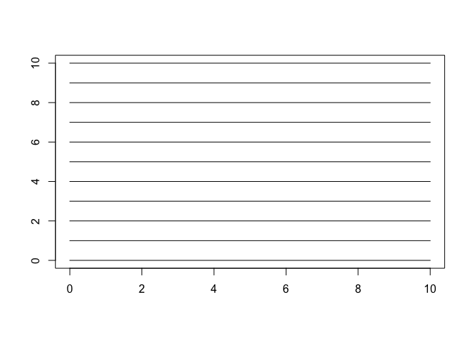
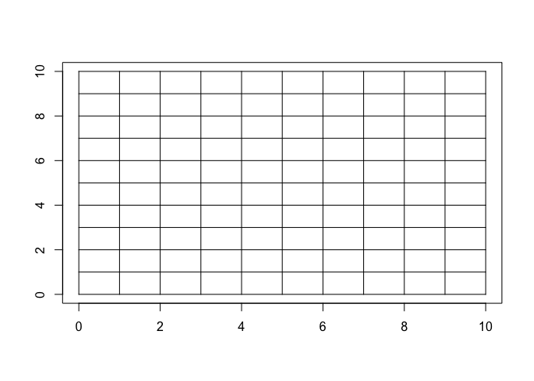
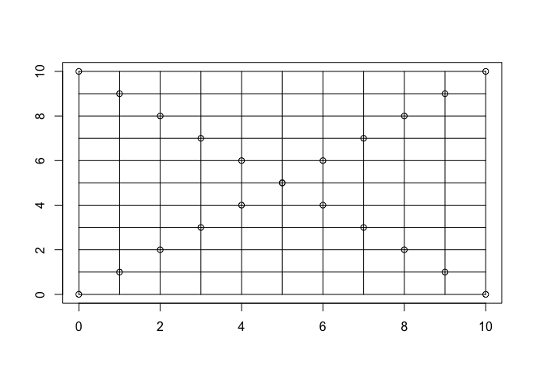

# 1. Beer Song

## a) Write a loop

(Note: from 99 to 0 bottle)


```r
x <- 99
  for (i in c(rev(seq_len(x)), 0)) {
    if (i == 0) {
      cat(glue::glue("No more bottles of beer on the wall, no more bottles of beer.\n Go to the store and buy some more, {x} bottles of beer on the wall."))
    } else {
      cat(glue::glue("{i} {if (i == 1) 'bottle' else 'bottles'} of beer on the wall, {i} {if (i == 1) 'bottle' else 'bottles'} of beer.\n Take one down and pass it around, {if (i == 1) 'no more' else i - 1} bottles of beer on the wall. \n \n \n"))
    }
  }
```

(Note: from 99 to 95 bottles)


```r
x <- 99
  for (i in c(seq(from = x, to = x - 4), 0)) {
    if (i == 0) {
      cat(glue::glue("No more bottles of beer on the wall, no more bottles of beer.\n Go to the store and buy some more, {x} bottles of beer on the wall."))
    } else {
      cat(glue::glue("{i} {if (i == 1) 'bottle' else 'bottles'} of beer on the wall, {i} {if (i == 1) 'bottle' else 'bottles'} of beer.\n Take one down and pass it around, {if (i == 1) 'no more' else i - 1} bottles of beer on the wall. \n \n \n"))
    }
}
```

```
## 99 bottles of beer on the wall, 99 bottles of beer.
## Take one down and pass it around, 98 bottles of beer on the wall. 
## 
##  98 bottles of beer on the wall, 98 bottles of beer.
## Take one down and pass it around, 97 bottles of beer on the wall. 
## 
##  97 bottles of beer on the wall, 97 bottles of beer.
## Take one down and pass it around, 96 bottles of beer on the wall. 
## 
##  96 bottles of beer on the wall, 96 bottles of beer.
## Take one down and pass it around, 95 bottles of beer on the wall. 
## 
##  95 bottles of beer on the wall, 95 bottles of beer.
## Take one down and pass it around, 94 bottles of beer on the wall. 
## 
##  No more bottles of beer on the wall, no more bottles of beer.
## Go to the store and buy some more, 99 bottles of beer on the wall.
```

## b) Convert loop to a function


```r
beersong <- function(x, liquid) {
  
  for (i in c(rev(seq_len(x)), 0)) {
    if (i == 0) {
      cat(glue::glue("No more bottles of {liquid} on the wall, no more bottles of wall.\n Go to the store and buy some more, {x} bottles of {liquid} on the wall."))
    } else {
      cat(glue::glue("{i} {if (i == 1) 'bottle' else 'bottles'} of {liquid} on the wall, {i} {if (i == 1) 'bottle' else 'bottles'} of {liquid}.\n Take one down and pass it around, {if (i == 1) 'no more' else i - 1} bottles of {liquid} on the wall. \n \n \n"))
    }
  }
}
beersong(3, 'Whiskey')
```

```
## 3 bottles of Whiskey on the wall, 3 bottles of Whiskey.
## Take one down and pass it around, 2 bottles of Whiskey on the wall. 
## 
##  2 bottles of Whiskey on the wall, 2 bottles of Whiskey.
## Take one down and pass it around, 1 bottles of Whiskey on the wall. 
## 
##  1 bottle of Whiskey on the wall, 1 bottle of Whiskey.
## Take one down and pass it around, no more bottles of Whiskey on the wall. 
## 
##  No more bottles of Whiskey on the wall, no more bottles of wall.
## Go to the store and buy some more, 3 bottles of Whiskey on the wall.
```

## c) Add error check


```r
beersong <- function(x, liquid) {
  
 if (is.numeric(x)) {
  for (i in c(rev(seq_len(x)), 0)) {
     if (i == 0) {
      cat(glue::glue("No more bottles of {liquid} on the wall, no more bottles of wall.\n Go to the store and buy some more, {x} bottles of {liquid} on the wall."))
    } else {
      cat(glue::glue("{i} {if (i == 1) 'bottle' else 'bottles'} of {liquid} on the wall, {i} {if (i == 1) 'bottle' else 'bottles'} of {liquid}.\n Take one down and pass it around, {if (i == 1) 'no more' else i - 1} bottles of {liquid} on the wall. \n \n \n"))
    }
   } 
  } else {
    cat("Ooooops...Error! Please enter a number.")
  }  
}  

beersong("beer", "Pepsi")
```

```
## Ooooops...Error! Please enter a number.
```


```r
beersong <- function(x, liquid) {
  
 if (is.numeric(x)) {
  for (i in c(rev(seq_len(x)), 0)) {
     if (i == 0) {
      cat(glue::glue("No more bottles of {liquid} on the wall, no more bottles of wall.\n Go to the store and buy some more, {x} bottles of {liquid} on the wall."))
    } else {
      cat(glue::glue("{i} {if (i == 1) 'bottle' else 'bottles'} of {liquid} on the wall, {i} {if (i == 1) 'bottle' else 'bottles'} of {liquid}.\n Take one down and pass it around, {if (i == 1) 'no more' else i - 1} bottles of {liquid} on the wall. \n \n \n"))
    }
   } 
  } else {
    cat("Ooooops...Error! Please enter a number.")
  }  
}  

beersong(3, "Pepsi")
```

```
## 3 bottles of Pepsi on the wall, 3 bottles of Pepsi.
## Take one down and pass it around, 2 bottles of Pepsi on the wall. 
## 
##  2 bottles of Pepsi on the wall, 2 bottles of Pepsi.
## Take one down and pass it around, 1 bottles of Pepsi on the wall. 
## 
##  1 bottle of Pepsi on the wall, 1 bottle of Pepsi.
## Take one down and pass it around, no more bottles of Pepsi on the wall. 
## 
##  No more bottles of Pepsi on the wall, no more bottles of wall.
## Go to the store and buy some more, 3 bottles of Pepsi on the wall.
```

## d) Convert loop to a fully generalized function


```r
beersong <- function(x, vessel, liquid, place) {
  
 if(is.numeric(x)) {
  for (i in c(rev(seq_len(x)), 0)) {
     if (i == 0) {
      cat(glue::glue("No more {vessel} of {liquid} on the {place}, no more {vessel} of {place}.\n Go to the store and buy some more, {x} {vessel}s of {liquid} on the {place}."))
    } else {
      cat(glue::glue("{i} {if (i == 1) {vessel} else {vessel}} of {liquid} on the {place}, {i} {if (i == 1) {vessel} else {vessel}} of {liquid}.\n Take one down and pass it around, {if (i == 1) 'no more' else i - 1} {vessel} of {liquid} on the {place}. \n \n \n"))
    }
   } 
  } else {
    cat("Ooooops...Error! Please enter a number.")
  }  
}  

beersong(3, "jugs", "milk", "shelf")
```

```
## 3 jugs of milk on the shelf, 3 jugs of milk.
## Take one down and pass it around, 2 jugs of milk on the shelf. 
## 
##  2 jugs of milk on the shelf, 2 jugs of milk.
## Take one down and pass it around, 1 jugs of milk on the shelf. 
## 
##  1 jugs of milk on the shelf, 1 jugs of milk.
## Take one down and pass it around, no more jugs of milk on the shelf. 
## 
##  No more jugs of milk on the shelf, no more jugs of shelf.
## Go to the store and buy some more, 3 jugss of milk on the shelf.
```

# 2. Draw a plot using a loop

## a) Plot with horizontal lines


```r
plot(1, type = "n", xlab = "", ylab = "", xlim = c(0, 10), ylim = c(0, 10))
m <- 10
for (i in c(seq_len(m), 0)) {
  lines(x = c(0, 10), y = c(i, i))
}
```

<!-- -->

## b) Add vertical lines


```r
plot(1, type = "n", xlab = "", ylab = "", xlim = c(0, 10), ylim = c(0, 10))
m <- 10
n <- 10
for (i in c(seq_len(m), 0)) {
  lines(x = c(0, 10), y = c(i, i))
}
for (t in c(seq_len(n), 0)) {
  lines(x = c(t, t), y = c(0, 10))
}
```

<!-- -->

## c) Add points


```r
plot(1, type = "n", xlab = "", ylab = "", xlim = c(0, 10), ylim = c(0, 10))
m <- 10
n <- 10
for (i in c(seq_len(m), 0)) {
  lines(x = c(0, 10), y = c(i, i))
  points(x = i, y = i)
  points(x = i, y = 10 - i)
}
for (t in c(seq_len(n), 0)) {
  lines(x = c(t, t), y = c(0, 10))
}
```

<!-- -->

## d) Convert to function

Note: the user to set the size of the plot (the plot should be square) and which items to draw (Hline - horizontal lines, Vline - vertical lines, point_diagonal - points on the diagonal). 

Enter number to set the size of the plot.
Enter "Y" or "N" to choose if you want to draw the item.


```r
draw_function <- function(size = 10, Hline = FALSE, Vline = FALSE, point_diagonal = TRUE) {

plot(1, type = "n", xlab = "", ylab = "", xlim = c(0, {size}), ylim = c(0, {size}))
if ({Hline} == "Y" && {Vline} == "Y" && {point_diagonal} == "Y") {
for (i in c(seq_len({size}), 0)) {
  lines(x = c(0, {size}), y = c(i, i))
  lines(x = c(i, i), y = c(0, {size}))
   points(x = i, y = i)
  points(x = i, y = {size} - i)
} 
} else if ({Hline} == "N" && {Vline} == "Y" && {point_diagonal} == "Y") {
 for (i in c(seq_len({size}), 0)) {
   lines(x = c(i, i), y = c(0, {size}))
   points(x = i, y = i)
  points(x = i, y = {size} - i)
}
} else if ({Hline} == "Y" && {Vline} == "N" && {point_diagonal} == "Y") {
  for (i in c(seq_len({size}), 0)) {
   lines(x = c(0, {size}), y = c(i, i))
   points(x = i, y = i)
  points(x = i, y = {size} - i)
  }
} else if ({Hline} == "Y" && {Vline} == "Y" && {point_diagonal} == "N") {
  for (i in c(seq_len({size}), 0)) {
  lines(x = c(0, {size}), y = c(i, i))
  lines(x = c(i, i), y = c(0, {size}))
  }
} else if ({Hline} == "Y" && {Vline} == "N" && {point_diagonal} == "N") {
  for (i in c(seq_len({size}), 0)) {
   lines(x = c(0, {size}), y = c(i, i))
  }
} else if ({Hline} == "N" && {Vline} == "Y" && {point_diagonal} == "N") {
 for (i in c(seq_len({size}), 0)) {
   lines(x = c(i, i), y = c(0, {size}))
 }
} else if ({Hline} == "N" && {Vline} == "N" && {point_diagonal} == "Y") {
 for (i in c(seq_len({size}), 0)) {
   points(x = i, y = i)
  points(x = i, y = {size} - i)
 }
} else if ({Hline} == "N" && {Vline} == "N" && {point_diagonal} == "N") {

}
}  

draw_function(10, "Y", "N", "Y")
draw_function(8, "Y", "Y", "Y")
```


