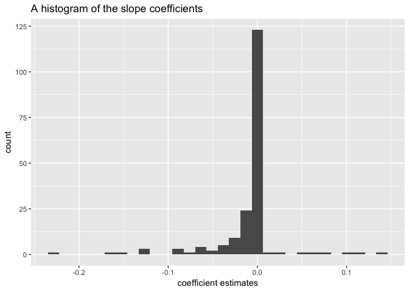

# 1. Functions in the R Base Package

## a) Longest name


```
## 
## Attaching package: 'dplyr'
```

```
## The following objects are masked from 'package:stats':
## 
##     filter, lag
```

```
## The following objects are masked from 'package:base':
## 
##     intersect, setdiff, setequal, union
```

```
##                           function_name name_length
## 1    getDLLRegisteredRoutines.character          34
## 2      getDLLRegisteredRoutines.DLLInfo          32
## 3        suppressPackageStartupMessages          30
## 4         as.data.frame.numeric_version          29
## 5          as.character.numeric_version          28
## 6           print.DLLRegisteredRoutines          27
## 7            as.data.frame.model.matrix          26
## 8            conditionMessage.condition          26
## 9            duplicated.numeric_version          26
## 10           invokeRestartInteractively          26
## 11             anyDuplicated.data.frame          24
## 12             as.data.frame.data.frame          24
## 13             default.stringsAsFactors          24
## 14             getDLLRegisteredRoutines          24
## 15              as.data.frame.character          23
## 16              as.list.numeric_version          23
## 17              conditionCall.condition          23
## 18              is.na<-.numeric_version          23
## 19              print.NativeRoutineList          23
## 20              Summary.numeric_version          23
## 21              testPlatformEquivalence          23
## 22               as.character.condition          22
## 23               as.data.frame.difftime          22
## 24               format.numeric_version          22
## 25               namespaceImportClasses          22
## 26               namespaceImportMethods          22
## 27               print.summary.warnings          22
## 28               row.names<-.data.frame          22
## 29               unique.numeric_version          22
## 30                all.equal.environment          21
## 31                all.equal.envRefClass          21
## 32                anyDuplicated.default          21
## 33                anyNA.numeric_version          21
## 34                as.data.frame.complex          21
## 35                as.data.frame.default          21
## 36                as.data.frame.integer          21
## 37                as.data.frame.logical          21
## 38                as.data.frame.noquote          21
## 39                as.data.frame.numeric          21
## 40                as.data.frame.ordered          21
## 41                as.data.frame.POSIXct          21
## 42                as.data.frame.POSIXlt          21
## 43                as.expression.default          21
## 44                dimnames<-.data.frame          21
## 45                droplevels.data.frame          21
## 46                duplicated.data.frame          21
## 47                format.summaryDefault          21
## 48                is.na.numeric_version          21
## 49                packageStartupMessage          21
## 50                print.numeric_version          21
## 51                xtfrm.numeric_version          21
## 52                 [[<-.numeric_version          20
## 53                 anyDuplicated.matrix          20
## 54                 as.character.default          20
## 55                 as.character.hexmode          20
## 56                 as.character.octmode          20
## 57                 as.data.frame.factor          20
## 58                 as.data.frame.matrix          20
## 59                 as.data.frame.vector          20
## 60                 as.matrix.data.frame          20
## 61                 as.POSIXlt.character          20
## 62                 getTaskCallbackNames          20
## 63                 library.dynam.unload          20
## 64                 loadingNamespaceInfo          20
## 65                 print.summaryDefault          20
## 66                 row.names.data.frame          20
## 67                 transform.data.frame          20
## 68                  [<-.numeric_version          19
## 69                  all.equal.character          19
## 70                  anyDuplicated.array          19
## 71                  as.character.factor          19
## 72                  as.character.POSIXt          19
## 73                  as.character.srcref          19
## 74                  as.data.frame.array          19
## 75                  as.data.frame.table          19
## 76                  as.function.default          19
## 77                  as.list.environment          19
## 78                  closeAllConnections          19
## 79                  dimnames.data.frame          19
## 80                  duplicated.warnings          19
## 81                  environmentIsLocked          19
## 82                  getNamespaceExports          19
## 83                  getNamespaceImports          19
## 84                  getNamespaceVersion          19
## 85                  getNativeSymbolInfo          19
## 86                  is.numeric.difftime          19
## 87                  namespaceImportFrom          19
## 88                  Ops.numeric_version          19
## 89                  packageHasNamespace          19
## 90                  print.summary.table          19
## 91                  rep.numeric_version          19
## 92                  row.names<-.default          19
## 93                  setSessionTimeLimit          19
## 94                  taskCallbackManager          19
## 95                  textConnectionValue          19
## 96                  truncate.connection          19
## 97                  withCallingHandlers          19
## 98                   [[.numeric_version          18
## 99                   all.equal.language          18
## 100                  as.character.error          18
## 101                  as.data.frame.AsIs          18
## 102                  as.data.frame.Date          18
## 103                  as.data.frame.list          18
## 104                  as.double.difftime          18
## 105                  as.list.data.frame          18
## 106                  as.numeric_version          18
## 107                  as.package_version          18
## 108                  as.POSIXct.default          18
## 109                  as.POSIXct.numeric          18
## 110                  as.POSIXct.POSIXlt          18
## 111                  as.POSIXlt.default          18
## 112                  as.POSIXlt.numeric          18
## 113                  as.POSIXlt.POSIXct          18
## 114                  close.srcfilealias          18
## 115                  determinant.matrix          18
## 116                  duplicated.default          18
## 117                  duplicated.POSIXlt          18
## 118                  format.packageInfo          18
## 119                  is.numeric_version          18
## 120                  is.package_version          18
## 121                  isSymmetric.matrix          18
## 122                  parseNamespaceFile          18
## 123                  rawConnectionValue          18
## 124                  removeTaskCallback          18
## 125                  restartDescription          18
## 126                  split<-.data.frame          18
## 127                  summary.connection          18
## 128                  summary.data.frame          18
## 129                  Summary.data.frame          18
## 130                  xpdrows.data.frame          18
## 131                   [.numeric_version          17
## 132                   $.package_version          17
## 133                   all.equal.default          17
## 134                   all.equal.formula          17
## 135                   all.equal.numeric          17
## 136                   as.character.Date          17
## 137                   as.data.frame.raw          17
## 138                   as.Date.character          17
## 139                   as.double.POSIXlt          17
## 140                   as.logical.factor          17
## 141                   as.matrix.default          17
## 142                   as.matrix.noquote          17
## 143                   as.matrix.POSIXlt          17
## 144                   as.POSIXlt.factor          17
## 145                   as.single.default          17
## 146                   c.numeric_version          17
## 147                   droplevels.factor          17
## 148                   duplicated.matrix          17
## 149                   format.data.frame          17
## 150                   format.libraryIQR          17
## 151                   getAllConnections          17
## 152                   getNamespaceUsers          17
## 153                   is.numeric.POSIXt          17
## 154                   isNamespaceLoaded          17
## 155                   length<-.difftime          17
## 156                   makeActiveBinding          17
## 157                   open.srcfilealias          17
## 158                   print.DLLInfoList          17
## 159                   print.packageInfo          17
## 160                   print.simple.list          17
## 161                   registerS3methods          17
## 162                   row.names.default          17
## 163                   rowsum.data.frame          17
## 164                   subset.data.frame          17
## 165                   summary.proc_time          17
## 166                   suspendInterrupts          17
## 167                   transform.default          17
## 168                   unique.data.frame          17
## 169                   within.data.frame          17
## 170                    all.equal.factor          16
## 171                    all.equal.POSIXt          16
## 172                    as.array.default          16
## 173                    as.data.frame.ts          16
## 174                    as.list.function          16
## 175                    as.table.default          16
## 176                    as.vector.factor          16
## 177                    browserCondition          16
## 178                    cbind.data.frame          16
## 179                    close.connection          16
## 180                    conditionMessage          16
## 181                    duplicated.array          16
## 182                    flush.connection          16
## 183                    getExportedValue          16
## 184                    getNamespaceInfo          16
## 185                    getNamespaceName          16
## 186                    is.na.data.frame          16
## 187                    length<-.POSIXct          16
## 188                    length<-.POSIXlt          16
## 189                    loadedNamespaces          16
## 190                    merge.data.frame          16
## 191                    mostattributes<-          16
## 192                    open.srcfilecopy          16
## 193                    print.connection          16
## 194                    print.data.frame          16
## 195                    print.libraryIQR          16
## 196                    R_system_version          16
## 197                    rbind.data.frame          16
## 198                    registerS3method          16
## 199                    requireNamespace          16
## 200                    setNamespaceInfo          16
## 201                    socketConnection          16
## 202                    split.data.frame          16
## 203                    Summary.difftime          16
## 204                    summary.warnings          16
## 205                    suppressMessages          16
## 206                    suppressWarnings          16
## 207                    toString.default          16
## 208                    units<-.difftime          16
## 209                     [[<-.data.frame          15
## 210                     addTaskCallback          15
## 211                     allowInterrupts          15
## 212                     as.Date.default          15
## 213                     as.Date.numeric          15
## 214                     as.Date.POSIXct          15
## 215                     as.Date.POSIXlt          15
## 216                     as.list.default          15
## 217                     as.list.POSIXct          15
## 218                     as.list.POSIXlt          15
## 219                     as.null.default          15
## 220                     as.POSIXct.Date          15
## 221                     as.POSIXlt.Date          15
## 222                     attachNamespace          15
## 223                     bindingIsActive          15
## 224                     bindingIsLocked          15
## 225                     browserSetDebug          15
## 226                     computeRestarts          15
## 227                     environmentName          15
## 228                     format.difftime          15
## 229                     is.na<-.default          15
## 230                     is.numeric.Date          15
## 231                     isBaseNamespace          15
## 232                     lazyLoadDBfetch          15
## 233                     length<-.factor          15
## 234                     levels<-.factor          15
## 235                     lockEnvironment          15
## 236                     Math.data.frame          15
## 237                     names<-.POSIXlt          15
## 238                     namespaceExport          15
## 239                     namespaceImport          15
## 240                     numeric_version          15
## 241                     open.connection          15
## 242                     package_version          15
## 243                     print.condition          15
## 244                     print.proc_time          15
## 245                     provideDimnames          15
## 246                     quarters.POSIXt          15
## 247                     seek.connection          15
## 248                     showConnections          15
## 249                     signalCondition          15
## 250                     simpleCondition          15
## 251                     split<-.default          15
## 252                     standardGeneric          15
## 253                     summary.default          15
## 254                     Summary.ordered          15
## 255                     summary.POSIXct          15
## 256                     Summary.POSIXct          15
## 257                     summary.POSIXlt          15
## 258                     Summary.POSIXlt          15
## 259                     summary.srcfile          15
## 260                     Sys.setFileTime          15
## 261                     unique.warnings          15
## 262                     unloadNamespace          15
## 263                     weekdays.POSIXt          15
## 264                      [<-.data.frame          14
## 265                      $<-.data.frame          14
## 266                      all.equal.list          14
## 267                      as.Date.factor          14
## 268                      as.environment          14
## 269                      as.list.factor          14
## 270                      attr.all.equal          14
## 271                      bindtextdomain          14
## 272                      curlGetHeaders          14
## 273                      debuggingState          14
## 274                      dim.data.frame          14
## 275                      extSoftVersion          14
## 276                      findPackageEnv          14
## 277                      format.default          14
## 278                      format.hexmode          14
## 279                      format.octmode          14
## 280                      format.POSIXct          14
## 281                      format.POSIXlt          14
## 282                      getCallingDLLe          14
## 283                      is.environment          14
## 284                      is.na<-.factor          14
## 285                      labels.default          14
## 286                      lazyLoadDBexec          14
## 287                      length.POSIXlt          14
## 288                      levels.default          14
## 289                      libcurlVersion          14
## 290                      memory.profile          14
## 291                      Ops.data.frame          14
## 292                      pretty.default          14
## 293                      print.difftime          14
## 294                      print.function          14
## 295                      print.warnings          14
## 296                      pushBackLength          14
## 297                      restartFormals          14
## 298                      rowsum.default          14
## 299                      simplify2array          14
## 300                      storage.mode<-          14
## 301                      subset.default          14
## 302                      summary.factor          14
## 303                      Summary.factor          14
## 304                      summary.matrix          14
## 305                      summary.srcref          14
## 306                      sys.load.image          14
## 307                      Sys.localeconv          14
## 308                      sys.save.image          14
## 309                      textConnection          14
## 310                      unique.default          14
## 311                      unique.POSIXlt          14
## 312                      units.difftime          14
## 313                      xtfrm.difftime          14
## 314                       [.DLLInfoList          13
## 315                       [.simple.list          13
## 316                       [[.data.frame          13
## 317                       all.equal.raw          13
## 318                       anyDuplicated          13
## 319                       anyNA.POSIXlt          13
## 320                       aperm.default          13
## 321                       as.data.frame          13
## 322                       as.expression          13
## 323                       by.data.frame          13
## 324                       clearPushBack          13
## 325                       close.srcfile          13
## 326                       conditionCall          13
## 327                       delayedAssign          13
## 328                       diff.difftime          13
## 329                       environment<-          13
## 330                       format.factor          13
## 331                       getCallingDLL          13
## 332                       getConnection          13
## 333                       geterrmessage          13
## 334                       getLoadedDLLs          13
## 335                       icuGetCollate          13
## 336                       icuSetCollate          13
## 337                       importIntoEnv          13
## 338                       invokeRestart          13
## 339                       is.data.frame          13
## 340                       is.expression          13
## 341                       is.na.POSIXlt          13
## 342                       julian.POSIXt          13
## 343                       kappa.default          13
## 344                       length<-.Date          13
## 345                       library.dynam          13
## 346                       loadNamespace          13
## 347                       Math.difftime          13
## 348                       mean.difftime          13
## 349                       memDecompress          13
## 350                       merge.default          13
## 351                       months.POSIXt          13
## 352                       names.POSIXlt          13
## 353                       normalizePath          13
## 354                       print.default          13
## 355                       print.DLLInfo          13
## 356                       print.hexmode          13
## 357                       print.noquote          13
## 358                       print.octmode          13
## 359                       print.POSIXct          13
## 360                       print.POSIXlt          13
## 361                       print.restart          13
## 362                       print.srcfile          13
## 363                       quarters.Date          13
## 364                       range.default          13
## 365                       rawConnection          13
## 366                       reg.finalizer          13
## 367                       scale.default          13
## 368                       simpleMessage          13
## 369                       simpleWarning          13
## 370                       solve.default          13
## 371                       split.default          13
## 372                       split.POSIXct          13
## 373                       subset.matrix          13
## 374                       summary.table          13
## 375                       Sys.getlocale          13
## 376                       Sys.setlocale          13
## 377                       unique.matrix          13
## 378                       unlockBinding          13
## 379                       weekdays.Date          13
## 380                       withAutoprint          13
## 381                       xtfrm.default          13
## 382                       xtfrm.POSIXct          13
## 383                       xtfrm.POSIXlt          13
## 384                        [.data.frame          12
## 385                        $.data.frame          12
## 386                        as.character          12
## 387                        as.list.Date          12
## 388                        attributes<-          12
## 389                        capabilities          12
## 390                        check_tzones          12
## 391                        chol.default          12
## 392                        contributors          12
## 393                        diff.default          12
## 394                        encodeString          12
## 395                        file.symlink          12
## 396                        find.package          12
## 397                        findInterval          12
## 398                        forceAndCall          12
## 399                        forwardsolve          12
## 400                        getNamespace          12
## 401                        is.character          12
## 402                        is.primitive          12
## 403                        is.recursive          12
## 404                        isIncomplete          12
## 405                        margin.table          12
## 406                        mean.default          12
## 407                        mean.POSIXct          12
## 408                        mean.POSIXlt          12
## 409                        open.srcfile          12
## 410                        Ops.difftime          12
## 411                        packageEvent          12
## 412                        parent.env<-          12
## 413                        parent.frame          12
## 414                        path.package          12
## 415                        print.factor          12
## 416                        print.listof          12
## 417                        print.srcref          12
## 418                        readRenviron          12
## 419                        regmatches<-          12
## 420                        round.POSIXt          12
## 421                        setTimeLimit          12
## 422                        socketSelect          12
## 423                        sort.default          12
## 424                        sort.POSIXlt          12
## 425                        srcfilealias          12
## 426                        storage.mode          12
## 427                        summary.Date          12
## 428                        Summary.Date          12
## 429                        sys.function          12
## 430                        Sys.readlink          12
## 431                        Sys.timezone          12
## 432                        Sys.unsetenv          12
## 433                        t.data.frame          12
## 434                        tracingState          12
## 435                        trunc.POSIXt          12
## 436                        unique.array          12
## 437                        with.default          12
## 438                        withRestarts          12
## 439                        xtfrm.factor          12
## 440                         [[<-.factor          11
## 441                         [<-.POSIXct          11
## 442                         [<-.POSIXlt          11
## 443                         aperm.table          11
## 444                         as.difftime          11
## 445                         as.function          11
## 446                         as.pairlist          11
## 447                         asNamespace          11
## 448                         browserText          11
## 449                         char.expand          11
## 450                         commandArgs          11
## 451                         Cstack_info          11
## 452                         cut.default          11
## 453                         data.matrix          11
## 454                         determinant          11
## 455                         diff.POSIXt          11
## 456                         env.profile          11
## 457                         environment          11
## 458                         eval.parent          11
## 459                         expand.grid          11
## 460                         file.access          11
## 461                         file.append          11
## 462                         file.choose          11
## 463                         file.create          11
## 464                         file.exists          11
## 465                         file.remove          11
## 466                         file.rename          11
## 467                         findRestart          11
## 468                         format.AsIs          11
## 469                         format.Date          11
## 470                         format.info          11
## 471                         format.pval          11
## 472                         getRversion          11
## 473                         getSrcLines          11
## 474                         interaction          11
## 475                         interactive          11
## 476                         inverse.rle          11
## 477                         is.function          11
## 478                         is.infinite          11
## 479                         is.language          11
## 480                         is.pairlist          11
## 481                         is.unsorted          11
## 482                         isNamespace          11
## 483                         ISOdatetime          11
## 484                         isSymmetric          11
## 485                         julian.Date          11
## 486                         lockBinding          11
## 487                         make.unique          11
## 488                         Math.factor          11
## 489                         Math.POSIXt          11
## 490                         memCompress          11
## 491                         months.Date          11
## 492                         Ops.ordered          11
## 493                         path.expand          11
## 494                         pcre_config          11
## 495                         print.Dlist          11
## 496                         print.eigen          11
## 497                         print.table          11
## 498                         rep.POSIXct          11
## 499                         rep.POSIXlt          11
## 500                         returnValue          11
## 501                         rev.default          11
## 502                         row.names<-          11
## 503                         searchpaths          11
## 504                         seq.default          11
## 505                         simpleError          11
## 506                         sink.number          11
## 507                         slice.index          11
## 508                         srcfilecopy          11
## 509                         substring<-          11
## 510                         sys.on.exit          11
## 511                         sys.parents          11
## 512                         system.file          11
## 513                         system.time          11
## 514                         unserialize          11
## 515                         within.list          11
## 516                         withVisible          11
## 517                          [.difftime          10
## 518                          [.warnings          10
## 519                          [[.POSIXct          10
## 520                          [[.POSIXlt          10
## 521                          [<-.factor          10
## 522                          *.difftime          10
## 523                          /.difftime          10
## 524                          abbreviate          10
## 525                          as.complex          10
## 526                          as.hexmode          10
## 527                          as.integer          10
## 528                          as.logical          10
## 529                          as.numeric          10
## 530                          as.octmode          10
## 531                          as.ordered          10
## 532                          as.POSIXct          10
## 533                          as.POSIXlt          10
## 534                          attributes          10
## 535                          autoloader          10
## 536                          bitwShiftL          10
## 537                          bitwShiftR          10
## 538                          by.default          10
## 539                          c.difftime          10
## 540                          c.warnings          10
## 541                          colnames<-          10
## 542                          cut.POSIXt          10
## 543                          data.class          10
## 544                          data.frame          10
## 545                          dimnames<-          10
## 546                          dir.create          10
## 547                          dir.exists          10
## 548                          droplevels          10
## 549                          duplicated          10
## 550                          dyn.unload          10
## 551                          enc2native          10
## 552                          Encoding<-          10
## 553                          expression          10
## 554                          file.mtime          10
## 555                          gctorture2          10
## 556                          getElement          10
## 557                          is.complex          10
## 558                          is.element          10
## 559                          is.integer          10
## 560                          is.logical          10
## 561                          is.numeric          10
## 562                          is.ordered          10
## 563                          isdebugged          10
## 564                          isSeekable          10
## 565                          La_library          10
## 566                          La_version          10
## 567                          lfactorial          10
## 568                          list.files          10
## 569                          make.names          10
## 570                          mat.or.vec          10
## 571                          match.call          10
## 572                          mem.limits          10
## 573                          NextMethod          10
## 574                          oldClass<-          10
## 575                          OlsonNames          10
## 576                          Ops.factor          10
## 577                          Ops.POSIXt          10
## 578                          parent.env          10
## 579                          pos.to.env          10
## 580                          print.AsIs          10
## 581                          print.Date          10
## 582                          prop.table          10
## 583                          qr.default          10
## 584                          regmatches          10
## 585                          rep.factor          10
## 586                          retracemem          10
## 587                          RNGversion          10
## 588                          round.Date          10
## 589                          rownames<-          10
## 590                          sample.int          10
## 591                          save.image          10
## 592                          seq.POSIXt          10
## 593                          split.Date          10
## 594                          startsWith          10
## 595                          substitute          10
## 596                          sys.frames          10
## 597                          Sys.getenv          10
## 598                          Sys.getpid          10
## 599                          sys.nframe          10
## 600                          sys.parent          10
## 601                          Sys.setenv          10
## 602                          sys.source          10
## 603                          sys.status          10
## 604                          tcrossprod          10
## 605                          trunc.Date          10
## 606                          untracemem          10
## 607                          writeLines          10
## 608                          xtfrm.AsIs          10
## 609                          xtfrm.Date          10
## 610                          xtfrm.Surv          10
## 611                           !.hexmode           9
## 612                           !.octmode           9
## 613                           [.hexmode           9
## 614                           [.noquote           9
## 615                           [.octmode           9
## 616                           [.POSIXct           9
## 617                           [.POSIXlt           9
## 618                           [[.factor           9
## 619                           &.hexmode           9
## 620                           &.octmode           9
## 621                           |.hexmode           9
## 622                           |.octmode           9
## 623                           $.DLLInfo           9
## 624                           all.equal           9
## 625                           all.names           9
## 626                           as.double           9
## 627                           as.factor           9
## 628                           as.matrix           9
## 629                           as.single           9
## 630                           as.symbol           9
## 631                           as.vector           9
## 632                           backsolve           9
## 633                           c.noquote           9
## 634                           c.POSIXct           9
## 635                           c.POSIXlt           9
## 636                           character           9
## 637                           charmatch           9
## 638                           charToRaw           9
## 639                           comment<-           9
## 640                           conflicts           9
## 641                           crossprod           9
## 642                           debugonce           9
## 643                           diff.Date           9
## 644                           dontCheck           9
## 645                           factorial           9
## 646                           file.copy           9
## 647                           file.info           9
## 648                           file.link           9
## 649                           file.mode           9
## 650                           file.path           9
## 651                           file.show           9
## 652                           file.size           9
## 653                           formals<-           9
## 654                           gctorture           9
## 655                           getOption           9
## 656                           globalenv           9
## 657                           iconvlist           9
## 658                           identical           9
## 659                           intersect           9
## 660                           intToBits           9
## 661                           intToUtf8           9
## 662                           invisible           9
## 663                           is.atomic           9
## 664                           is.double           9
## 665                           is.factor           9
## 666                           is.finite           9
## 667                           is.loaded           9
## 668                           is.matrix           9
## 669                           is.object           9
## 670                           is.single           9
## 671                           is.symbol           9
## 672                           is.vector           9
## 673                           isRestart           9
## 674                           kronecker           9
## 675                           l10n_info           9
## 676                           list.dirs           9
## 677                           lower.tri           9
## 678                           match.arg           9
## 679                           match.fun           9
## 680                           Math.Date           9
## 681                           mean.Date           9
## 682                           prettyNum           9
## 683                           print.rle           9
## 684                           proc.time           9
## 685                           qr.fitted           9
## 686                           R.Version           9
## 687                           rawToBits           9
## 688                           rawToChar           9
## 689                           readLines           9
## 690                           replicate           9
## 691                           row.names           9
## 692                           seq_along           9
## 693                           serialize           9
## 694                           sort.list           9
## 695                           stopifnot           9
## 696                           structure           9
## 697                           substring           9
## 698                           sys.calls           9
## 699                           Sys.chmod           9
## 700                           sys.frame           9
## 701                           Sys.sleep           9
## 702                           Sys.umask           9
## 703                           Sys.which           9
## 704                           t.default           9
## 705                           traceback           9
## 706                           transform           9
## 707                           unix.time           9
## 708                           upper.tri           9
## 709                           UseMethod           9
## 710                           utf8ToInt           9
## 711                           validUTF8           9
## 712                           Vectorize           9
## 713                           which.max           9
## 714                           which.min           9
## 715                           write.dcf           9
## 716                           writeChar           9
## 717                            -.POSIXt           8
## 718                            [.factor           8
## 719                            [.listof           8
## 720                            [<-.Date           8
## 721                            +.POSIXt           8
## 722                            all.vars           8
## 723                            arrayInd           8
## 724                            as.array           8
## 725                            as.table           8
## 726                            autoload           8
## 727                            basename           8
## 728                            builtins           8
## 729                            casefold           8
## 730                            chol2inv           8
## 731                            colMeans           8
## 732                            colnames           8
## 733                            cut.Date           8
## 734                            difftime           8
## 735                            dimnames           8
## 736                            dyn.load           8
## 737                            emptyenv           8
## 738                            enc2utf8           8
## 739                            Encoding           8
## 740                            endsWith           8
## 741                            formatDL           8
## 742                            function           8
## 743                            gettextf           8
## 744                            gregexpr           8
## 745                            grouping           8
## 746                            identity           8
## 747                            inherits           8
## 748                            is.array           8
## 749                            is.table           8
## 750                            kappa.lm           8
## 751                            kappa.qr           8
## 752                            lazyLoad           8
## 753                            length<-           8
## 754                            levels<-           8
## 755                            list2env           8
## 756                            ngettext           8
## 757                            oldClass           8
## 758                            Ops.Date           8
## 759                            packBits           8
## 760                            pairlist           8
## 761                            pmax.int           8
## 762                            pmin.int           8
## 763                            polyroot           8
## 764                            Position           8
## 765                            print.by           8
## 766                            prmatrix           8
## 767                            psigamma           8
## 768                            pushBack           8
## 769                            qr.resid           8
## 770                            qr.solve           8
## 771                            quarters           8
## 772                            rawShift           8
## 773                            read.dcf           8
## 774                            readChar           8
## 775                            readline           8
## 776                            rep.Date           8
## 777                            rowMeans           8
## 778                            rownames           8
## 779                            seq.Date           8
## 780                            sequence           8
## 781                            set.seed           8
## 782                            setequal           8
## 783                            solve.qr           8
## 784                            sort.int           8
## 785                            strftime           8
## 786                            strptime           8
## 787                            strsplit           8
## 788                            substr<-           8
## 789                            sys.call           8
## 790                            Sys.Date           8
## 791                            Sys.glob           8
## 792                            Sys.info           8
## 793                            Sys.time           8
## 794                            tabulate           8
## 795                            tempfile           8
## 796                            toString           8
## 797                            tracemem           8
## 798                            trigamma           8
## 799                            truncate           8
## 800                            tryCatch           8
## 801                            validEnc           8
## 802                            warnings           8
## 803                            weekdays           8
## 804                            writeBin           8
## 805                            zapsmall           8
## 806                             [.Dlist           7
## 807                             [.table           7
## 808                             [[.Date           7
## 809                             as.call           7
## 810                             as.Date           7
## 811                             as.list           7
## 812                             as.name           7
## 813                             as.null           7
## 814                             baseenv           7
## 815                             besselI           7
## 816                             besselJ           7
## 817                             besselK           7
## 818                             besselY           7
## 819                             bitwAnd           7
## 820                             bitwNot           7
## 821                             bitwXor           7
## 822                             browser           7
## 823                             ceiling           7
## 824                             chkDots           7
## 825                             class<-           7
## 826                             colSums           7
## 827                             comment           7
## 828                             complex           7
## 829                             cumprod           7
## 830                             deparse           7
## 831                             digamma           7
## 832                             dirname           7
## 833                             do.call           7
## 834                             enquote           7
## 835                             formals           7
## 836                             formatC           7
## 837                             gc.time           7
## 838                             getHook           7
## 839                             gettext           7
## 840                             grepRaw           7
## 841                             integer           7
## 842                             is.call           7
## 843                             is.list           7
## 844                             is.na<-           7
## 845                             is.name           7
## 846                             is.null           7
## 847                             isFALSE           7
## 848                             ISOdate           7
## 849                             lchoose           7
## 850                             lengths           7
## 851                             library           7
## 852                             licence           7
## 853                             license           7
## 854                             logical           7
## 855                             max.col           7
## 856                             message           7
## 857                             missing           7
## 858                             names<-           7
## 859                             new.env           7
## 860                             nlevels           7
## 861                             noquote           7
## 862                             numeric           7
## 863                             objects           7
## 864                             on.exit           7
## 865                             options           7
## 866                             ordered           7
## 867                             qr.coef           7
## 868                             readBin           7
## 869                             readRDS           7
## 870                             regexec           7
## 871                             regexpr           7
## 872                             rep_len           7
## 873                             rep.int           7
## 874                             replace           7
## 875                             require           7
## 876                             RNGkind           7
## 877                             rowSums           7
## 878                             saveRDS           7
## 879                             seq_len           7
## 880                             seq.int           7
## 881                             setdiff           7
## 882                             setHook           7
## 883                             shQuote           7
## 884                             split<-           7
## 885                             sprintf           7
## 886                             srcfile           7
## 887                             strtrim           7
## 888                             strwrap           7
## 889                             summary           7
## 890                             system2           7
## 891                             tempdir           7
## 892                             tolower           7
## 893                             toupper           7
## 894                             unclass           7
## 895                             undebug           7
## 896                             units<-           7
## 897                             unsplit           7
## 898                             untrace           7
## 899                             warning           7
## 900                              -.Date           6
## 901                              [.AsIs           6
## 902                              [.Date           6
## 903                              +.Date           6
## 904                              agrepl           6
## 905                              append           6
## 906                              as.raw           6
## 907                              assign           6
## 908                              attach           6
## 909                              attr<-           6
## 910                              bitwOr           6
## 911                              body<-           6
## 912                              bquote           6
## 913                              bzfile           6
## 914                              c.Date           6
## 915                              callCC           6
## 916                              chartr           6
## 917                              choose           6
## 918                              cummax           6
## 919                              cummin           6
## 920                              cumsum           6
## 921                              detach           6
## 922                              diag<-           6
## 923                              double           6
## 924                              dQuote           6
## 925                              dynGet           6
## 926                              eapply           6
## 927                              exists           6
## 928                              factor           6
## 929                              Filter           6
## 930                              format           6
## 931                              gcinfo           6
## 932                              gzfile           6
## 933                              ifelse           6
## 934                              is.nan           6
## 935                              is.raw           6
## 936                              isatty           6
## 937                              isOpen           6
## 938                              isTRUE           6
## 939                              jitter           6
## 940                              julian           6
## 941                              La.svd           6
## 942                              labels           6
## 943                              lapply           6
## 944                              length           6
## 945                              levels           6
## 946                              lgamma           6
## 947                              mapply           6
## 948                              matrix           6
## 949                              mode<-           6
## 950                              months           6
## 951                              Negate           6
## 952                              nzchar           6
## 953                              paste0           6
## 954                              pmatch           6
## 955                              pretty           6
## 956                              qr.qty           6
## 957                              R.home           6
## 958                              rapply           6
## 959                              Recall           6
## 960                              Reduce           6
## 961                              remove           6
## 962                              repeat           6
## 963                              return           6
## 964                              rowsum           6
## 965                              sample           6
## 966                              sapply           6
## 967                              search           6
## 968                              signif           6
## 969                              single           6
## 970                              source           6
## 971                              sQuote           6
## 972                              srcref           6
## 973                              stderr           6
## 974                              stdout           6
## 975                              strrep           6
## 976                              strtoi           6
## 977                              subset           6
## 978                              substr           6
## 979                              switch           6
## 980                              system           6
## 981                              tapply           6
## 982                              topenv           6
## 983                              trimws           6
## 984                              typeof           6
## 985                              unique           6
## 986                              unlink           6
## 987                              unlist           6
## 988                              unname           6
## 989                              vapply           6
## 990                              vector           6
## 991                              within           6
## 992                              xzfile           6
## 993                               acosh           5
## 994                               addNA           5
## 995                               agrep           5
## 996                               alist           5
## 997                               anyNA           5
## 998                               aperm           5
## 999                               apply           5
## 1000                              array           5
## 1001                              as.qr           5
## 1002                              asinh           5
## 1003                              atan2           5
## 1004                              atanh           5
## 1005                              break           5
## 1006                              cbind           5
## 1007                              class           5
## 1008                              close           5
## 1009                              cospi           5
## 1010                              debug           5
## 1011                              dim<-           5
## 1012                              eigen           5
## 1013                              evalq           5
## 1014                              expm1           5
## 1015                              floor           5
## 1016                              flush           5
## 1017                              force           5
## 1018                              gamma           5
## 1019                              getwd           5
## 1020                              grepl           5
## 1021                              gzcon           5
## 1022                              iconv           5
## 1023                              is.na           5
## 1024                              is.qr           5
## 1025                              kappa           5
## 1026                              lbeta           5
## 1027                              local           5
## 1028                              log10           5
## 1029                              log1p           5
## 1030                              match           5
## 1031                              merge           5
## 1032                              names           5
## 1033                              nargs           5
## 1034                              nchar           5
## 1035                              order           5
## 1036                              outer           5
## 1037                              parse           5
## 1038                              paste           5
## 1039                              print           5
## 1040                              qr.qy           5
## 1041                              quote           5
## 1042                              range           5
## 1043                              rbind           5
## 1044                              rcond           5
## 1045                              round           5
## 1046                              scale           5
## 1047                              setwd           5
## 1048                              sinpi           5
## 1049                              solve           5
## 1050                              split           5
## 1051                              stdin           5
## 1052                              sweep           5
## 1053                              table           5
## 1054                              tanpi           5
## 1055                              trace           5
## 1056                              trunc           5
## 1057                              union           5
## 1058                              units           5
## 1059                              which           5
## 1060                              while           5
## 1061                              write           5
## 1062                              xtfrm           5
## 1063                               [[<-           4
## 1064                               %in%           4
## 1065                               acos           4
## 1066                               args           4
## 1067                               asin           4
## 1068                               asS3           4
## 1069                               asS4           4
## 1070                               atan           4
## 1071                               attr           4
## 1072                               beta           4
## 1073                               body           4
## 1074                               call           4
## 1075                               chol           4
## 1076                               Conj           4
## 1077                               cosh           4
## 1078                               date           4
## 1079                               dget           4
## 1080                               diag           4
## 1081                               diff           4
## 1082                               dput           4
## 1083                               drop           4
## 1084                               dump           4
## 1085                               eval           4
## 1086                               fifo           4
## 1087                               file           4
## 1088                               Find           4
## 1089                               get0           4
## 1090                               grep           4
## 1091                               gsub           4
## 1092                               is.R           4
## 1093                               isS4           4
## 1094                               list           4
## 1095                               load           4
## 1096                               log2           4
## 1097                               logb           4
## 1098                               mean           4
## 1099                               mget           4
## 1100                               mode           4
## 1101                               ncol           4
## 1102                               NCOL           4
## 1103                               next           4
## 1104                               norm           4
## 1105                               nrow           4
## 1106                               NROW           4
## 1107                               open           4
## 1108                               pipe           4
## 1109                               pmax           4
## 1110                               pmin           4
## 1111                               prod           4
## 1112                               qr.Q           4
## 1113                               qr.R           4
## 1114                               qr.X           4
## 1115                               quit           4
## 1116                               rank           4
## 1117                               save           4
## 1118                               scan           4
## 1119                               seek           4
## 1120                               sign           4
## 1121                               sinh           4
## 1122                               sink           4
## 1123                               sort           4
## 1124                               sqrt           4
## 1125                               stop           4
## 1126                               tanh           4
## 1127                               with           4
## 1128                                :::           3
## 1129                                [<-           3
## 1130                                @<-           3
## 1131                                %*%           3
## 1132                                %/%           3
## 1133                                %o%           3
## 1134                                %x%           3
## 1135                                <<-           3
## 1136                                $<-           3
## 1137                                abs           3
## 1138                                all           3
## 1139                                any           3
## 1140                                Arg           3
## 1141                                cat           3
## 1142                                col           3
## 1143                                cos           3
## 1144                                cut           3
## 1145                                det           3
## 1146                                dim           3
## 1147                                dir           3
## 1148                                exp           3
## 1149                                for           3
## 1150                                get           3
## 1151                                log           3
## 1152                                Map           3
## 1153                                max           3
## 1154                                min           3
## 1155                                Mod           3
## 1156                                raw           3
## 1157                                rep           3
## 1158                                rev           3
## 1159                                rle           3
## 1160                                row           3
## 1161                                seq           3
## 1162                                sin           3
## 1163                                sub           3
## 1164                                sum           3
## 1165                                svd           3
## 1166                                tan           3
## 1167                                try           3
## 1168                                unz           3
## 1169                                url           3
## 1170                                xor           3
## 1171                                 ::           2
## 1172                                 !=           2
## 1173                                 [[           2
## 1174                                 &&           2
## 1175                                 %%           2
## 1176                                 <-           2
## 1177                                 <=           2
## 1178                                 ==           2
## 1179                                 >=           2
## 1180                                 ||           2
## 1181                                 by           2
## 1182                                 gc           2
## 1183                                 gl           2
## 1184                                 if           2
## 1185                                 Im           2
## 1186                                 ls           2
## 1187                                 qr           2
## 1188                                 Re           2
## 1189                                 rm           2
## 1190                                  -           1
## 1191                                  :           1
## 1192                                  !           1
## 1193                                  (           1
## 1194                                  [           1
## 1195                                  {           1
## 1196                                  @           1
## 1197                                  *           1
## 1198                                  /           1
## 1199                                  &           1
## 1200                                  ^           1
## 1201                                  +           1
## 1202                                  <           1
## 1203                                  =           1
## 1204                                  >           1
## 1205                                  |           1
## 1206                                  ~           1
## 1207                                  $           1
## 1208                                  c           1
## 1209                                  I           1
## 1210                                  q           1
## 1211                                  t           1
```

From the table above, we can see that function - "getDLLRegisteredRoutines.character" has the longest name with 34 characters.

## b) Number of arguments


```
## Selecting by argu_length
```

```
##       function_name argu_length
## 1              scan          22
## 2    format.default          16
## 3            source          16
## 4           formatC          14
## 5  merge.data.frame          13
## 6         prettyNum          12
## 7           system2          11
## 8              save          10
## 9            system          10
## 10          library           9
## 11    print.default           9
## 12    withAutoprint           9
```
 
The table df1 present the top 10 functions with the most arguments. As we can see, the function - "scan" has the most arguments with 10 arguments.

## c) No arguments


```
##   c..Null....Primitive.. c.a..b.
## 1                   Null     224
## 2              Primitive     183
```

I check the number of function arguments with formals() retuning NULL. From the table above, we can see that there 224 functions returning NULL, that means there are 224 base functions without arguments. I also check the number with formals() returning NULL as well as is.primitive(), the output is 183. As a result, the difference is that among all the base functions without arguments, there are 183 primitive functions, and 41 non-primitive functions.  

#2. Infant Mortality and GPD per Capita

## a) Highest and lowest infant mortality rates in 2017


```
## Loading required package: RJSONIO
```

```
## ─ Attaching packages ───── tidyverse 1.2.1 ─
```

```
## ✔ ggplot2 3.0.0     ✔ readr   1.1.1
## ✔ tibble  1.4.2     ✔ stringr 1.3.1
## ✔ tidyr   0.8.1     ✔ forcats 0.3.0
```

```
## ─ Conflicts ─────── tidyverse_conflicts() ─
## ✖ dplyr::filter() masks stats::filter()
## ✖ dplyr::lag()    masks stats::lag()
```

```
##                    country              region    gdpcap infmort year
## 1 Central African Republic Sub-Saharan Africa   661.2400    87.6 2017
## 2             Sierra Leone Sub-Saharan Africa  1390.3003    81.7 2017
## 3                  Somalia Sub-Saharan Africa         NA    79.7 2017
## 4                     Chad Sub-Saharan Africa  1768.1534    73.4 2017
## 5         Congo, Dem. Rep. Sub-Saharan Africa   808.1332    70.0 2017
```

```
##      country                region   gdpcap infmort year
## 1    Iceland Europe & Central Asia 46482.96     1.6 2017
## 2   Slovenia Europe & Central Asia 31400.84     1.7 2017
## 3    Finland Europe & Central Asia 40585.72     1.9 2017
## 4      Japan   East Asia & Pacific 39002.22     1.9 2017
## 5 San Marino Europe & Central Asia 56861.47     2.0 2017
```

The first table is a list of countries with the 5 highest infant mortality rates in 2017 along with their GDP per capita in that year.
The first table is a list of countries with the 5 lowest infant mortality rates in 2017 along with their GDP per capita in that year.

## b) Overall regression


```
## 
## Call:
## lm(formula = infmort ~ gdpcap, data = df4)
## 
## Residuals:
##     Min      1Q  Median      3Q     Max 
## -35.269 -19.980  -9.016  12.683 127.142 
## 
## Coefficients:
##               Estimate Std. Error t value Pr(>|t|)    
## (Intercept)  4.857e+01  4.926e-01   98.60   <2e-16 ***
## gdpcap      -9.318e-04  2.077e-05  -44.86   <2e-16 ***
## ---
## Signif. codes:  0 '***' 0.001 '**' 0.01 '*' 0.05 '.' 0.1 ' ' 1
## 
## Residual standard error: 26.84 on 4981 degrees of freedom
##   (7545 observations deleted due to missingness)
## Multiple R-squared:  0.2877,	Adjusted R-squared:  0.2876 
## F-statistic:  2012 on 1 and 4981 DF,  p-value: < 2.2e-16
```

```
##   (Intercept)        gdpcap 
## 48.5703278267 -0.0009318072
```

```
## Warning: Removed 7545 rows containing non-finite values (stat_smooth).
```

```
## Warning: Removed 7545 rows containing missing values (geom_point).
```

<!-- -->

From the results and plot above, we can see that p-value: < 2.2e-16, which means there exists a negative correlation bewteen GDP per capita and Infant mortality. The estimate of variable infmort is -9.318e-04, which indicates that for each point higher of GDP per capita, there is 9.318e-04 points lower of infant mortality.

## c) Regression by region


```
##                       region coefficient estimates
## 1              North America         -8.223335e-06
## 2 Middle East & North Africa         -2.776021e-04
## 3      Europe & Central Asia         -4.920161e-04
## 4        East Asia & Pacific         -5.995109e-04
## 5 Latin America & Caribbean          -1.102494e-03
## 6        Sub-Saharan Africa          -2.351682e-03
## 7                 South Asia         -5.658714e-03
```

The table above presents the coefficient estimates for the slope for each region.

## d) Regression by country


```
##                     country       coefes       pvalue
## 1                Madagascar 1.358330e-01 1.473682e-02
## 2                   Burundi 1.133593e-01 1.178293e-03
## 3                   Comoros 9.876322e-02 2.527516e-03
## 4             Guinea.Bissau 6.987750e-02 2.567207e-02
## 5  Central.African.Republic 5.731636e-02 4.109290e-04
## 6                     Gabon 3.572182e-03 6.952342e-07
## 7                  Dominica 3.024546e-03 9.266712e-05
## 8               South.Sudan 1.593684e-03 3.304944e-02
## 9      United.Arab.Emirates 9.847707e-05 4.620178e-08
## 10        Brunei.Darussalam 8.352228e-05 1.012051e-04
```

```
## Percentage = 5.405405 %
```

From the results above,  there are 5.405405% of countries have a positive relationship (at the 95% confidence level) between GDP per capita and infant mortality. The 10 countries listed in the table are at odds with the overall regression estimated in part (b). And the coefficient estimates of Madagascar is the largest, as a result, Madagascar is at most odds with the overall regression estimated in part (b).


```
## `stat_bin()` using `bins = 30`. Pick better value with `binwidth`.
```

<!-- -->

The histogram above illustrates the variation of the estimated relationship.

## e) Added squared term


```
##                            Country   r_squared1  r_squared2
## 1                      Afghanistan  0.919173429  0.91500256
## 2                          Albania  0.936348666  0.95309497
## 3                          Algeria  0.909059899  0.91061901
## 4                           Angola  0.902462282  0.90461311
## 5              Antigua and Barbuda  0.463366117  0.81059798
## 6                        Argentina  0.716794177  0.70591300
## 7                          Armenia  0.791315416  0.78432522
## 8                        Australia  0.918675913  0.91547333
## 9                          Austria  0.898411983  0.93303831
## 10                      Azerbaijan  0.788286770  0.78528347
## 11                    Bahamas, The -0.025184442 -0.05405839
## 12                         Bahrain  0.150483282  0.21611960
## 13                      Bangladesh  0.831417771  0.96475949
## 14                        Barbados  0.189105490  0.16622419
## 15                         Belarus  0.923037299  0.93353387
## 16                         Belgium  0.935805449  0.96142224
## 17                          Belize  0.831147771  0.82778151
## 18                           Benin  0.947797629  0.96643930
## 19                          Bhutan  0.882458202  0.98327615
## 20                         Bolivia  0.825593287  0.96791072
## 21          Bosnia and Herzegovina  0.976176073  0.97670509
## 22                        Botswana  0.524750805  0.78150287
## 23                          Brazil  0.809172657  0.94478941
## 24               Brunei Darussalam  0.425517422  0.55297193
## 25                        Bulgaria  0.983633602  0.98458334
## 26                    Burkina Faso  0.975787590  0.98917095
## 27                         Burundi  0.312444247  0.33049783
## 28                      Cabo Verde  0.917578432  0.95480737
## 29                        Cambodia  0.925626436  0.95929590
## 30                        Cameroon  0.839327654  0.86018972
## 31                          Canada  0.855603812  0.86838780
## 32        Central African Republic  0.363174824  0.58079772
## 33                            Chad  0.805738042  0.80693793
## 34                           Chile  0.816019880  0.97062944
## 35                           China  0.882777910  0.98635406
## 36                        Colombia  0.824185927  0.89602061
## 37                         Comoros  0.273598318  0.31876815
## 38                Congo, Dem. Rep.  0.068218840  0.12272838
## 39                     Congo, Rep.  0.644659918  0.63655705
## 40                      Costa Rica  0.858225439  0.95365027
## 41                   Cote d'Ivoire -0.030522018  0.36506121
## 42                         Croatia  0.905704008  0.90311006
## 43                          Cyprus  0.729115518  0.81128751
## 44                  Czech Republic  0.729326814  0.83900428
## 45                         Denmark  0.909487625  0.94042692
## 46                        Djibouti  0.000000000  0.00000000
## 47                        Dominica  0.429246825  0.49696773
## 48              Dominican Republic  0.828106586  0.96592558
## 49                         Ecuador  0.643191638  0.69073759
## 50                Egypt, Arab Rep.  0.900583930  0.97650458
## 51                     El Salvador  0.926793367  0.96706400
## 52               Equatorial Guinea  0.713170169  0.74376585
## 53                         Eritrea -0.036750946  0.28728597
## 54                         Estonia  0.926652246  0.94597980
## 55                        Ethiopia  0.740224656  0.84370745
## 56                            Fiji  0.127163114  0.73290388
## 57                         Finland  0.804774595  0.80179310
## 58                          France  0.881470588  0.92941048
## 59                           Gabon  0.604018162  0.58829079
## 60                     Gambia, The  0.390641327  0.37558834
## 61                         Georgia  0.587032796  0.58081113
## 62                         Germany  0.836094881  0.95704003
## 63                           Ghana  0.917945437  0.97248327
## 64                          Greece  0.597091947  0.78959413
## 65                         Grenada  0.260096755  0.70560749
## 66                       Guatemala  0.965406034  0.99184464
## 67                          Guinea  0.745096217  0.86913348
## 68                   Guinea-Bissau  0.145616082  0.13577096
## 69                          Guyana  0.931955503  0.96238146
## 70                           Haiti  0.059431696  0.65826567
## 71                        Honduras  0.826525222  0.86654627
## 72                         Hungary  0.894250662  0.92166417
## 73                         Iceland  0.865912761  0.89451330
## 74                           India  0.918541424  0.98440228
## 75                       Indonesia  0.794429320  0.89346295
## 76              Iran, Islamic Rep.  0.850178351  0.89233135
## 77                            Iraq  0.724334571  0.75782784
## 78                         Ireland  0.788710122  0.80509603
## 79                          Israel  0.920910301  0.97570322
## 80                           Italy  0.511947842  0.73406596
## 81                         Jamaica  0.108878035  0.26899449
## 82                           Japan  0.894395999  0.91803063
## 83                          Jordan  0.702120772  0.82509864
## 84                      Kazakhstan  0.936551712  0.93870148
## 85                           Kenya  0.634924491  0.64432836
## 86                        Kiribati  0.005137039  0.06262904
## 87                     Korea, Rep.  0.902709621  0.98706922
## 88                          Kuwait  0.031856461  0.15433399
## 89                 Kyrgyz Republic  0.308555271  0.34174667
## 90                         Lao PDR  0.869772323  0.97879129
## 91                          Latvia  0.926913094  0.93391087
## 92                         Lebanon  0.581603888  0.56911565
## 93                         Lesotho  0.070080411  0.81008859
## 94                         Liberia  0.251038352  0.30765569
## 95                           Libya  0.033605845  0.22709475
## 96                       Lithuania  0.911836749  0.92307588
## 97                      Luxembourg  0.936007970  0.95255413
## 98                  Macedonia, FYR  0.291932521  0.27797343
## 99                      Madagascar  0.177468001  0.15880700
## 100                         Malawi  0.733684757  0.72419940
## 101                       Malaysia  0.747617118  0.92176532
## 102                       Maldives  0.819049768  0.89149337
## 103                           Mali  0.926465931  0.94205767
## 104                          Malta  0.820764937  0.99424975
## 105               Marshall Islands  0.549156039  0.56304777
## 106                     Mauritania  0.802150649  0.86014563
## 107                      Mauritius  0.789243556  0.84853436
## 108                         Mexico  0.889436064  0.89072603
## 109          Micronesia, Fed. Sts.  0.503441610  0.52251369
## 110                        Moldova  0.724224548  0.85922424
## 111                       Mongolia  0.743012225  0.85444161
## 112                     Montenegro  0.933298033  0.93101332
## 113                        Morocco  0.903755690  0.94579588
## 114                     Mozambique  0.961779848  0.99025154
## 115                        Myanmar  0.927454838  0.95877493
## 116                        Namibia  0.955424456  0.95381039
## 117                          Nauru  0.864363614  0.90545379
## 118                          Nepal  0.877212604  0.98886030
## 119                    Netherlands  0.924488392  0.92537484
## 120                    New Zealand  0.902288048  0.93592960
## 121                      Nicaragua  0.825676030  0.94629161
## 122                          Niger  0.078621882  0.08593171
## 123                        Nigeria  0.923077969  0.92076800
## 124                         Norway  0.912839646  0.91060566
## 125                           Oman  0.550440206  0.73806138
## 126                       Pakistan  0.931913349  0.95066310
## 127                          Palau -0.053404875 -0.10432198
## 128                         Panama  0.938610164  0.97729595
## 129               Papua New Guinea  0.468025476  0.48848325
## 130                       Paraguay  0.567618749  0.55243789
## 131                           Peru  0.753422022  0.92370121
## 132                    Philippines  0.665604568  0.82114236
## 133                         Poland  0.854789508  0.97518759
## 134                       Portugal  0.879345662  0.88739885
## 135                          Qatar  0.523023779  0.62976798
## 136                        Romania  0.924722242  0.93199203
## 137             Russian Federation  0.787237978  0.80715276
## 138                         Rwanda  0.911113037  0.93473044
## 139                          Samoa  0.893021387  0.92070060
## 140                     San Marino  0.133782370  0.46829510
## 141          Sao Tome and Principe  0.973277093  0.98685650
## 142                   Saudi Arabia  0.178218250  0.25341860
## 143                        Senegal  0.929390268  0.92685215
## 144                         Serbia  0.851308080  0.87631321
## 145                     Seychelles  0.059214946  0.46062637
## 146                   Sierra Leone  0.537457510  0.52450904
## 147                      Singapore  0.710151163  0.95957609
## 148                Slovak Republic  0.921853672  0.96922186
## 149                       Slovenia  0.883666954  0.89113423
## 150                Solomon Islands -0.038315203 -0.03567402
## 151                   South Africa  0.540445667  0.89016312
## 152                    South Sudan  0.648129552  0.84693061
## 153                          Spain  0.798954840  0.85586845
## 154                      Sri Lanka  0.923081033  0.97010452
## 155            St. Kitts and Nevis  0.910157710  0.90745588
## 156                      St. Lucia  0.379515124  0.47356784
## 157 St. Vincent and the Grenadines  0.279720702  0.44847182
## 158                          Sudan  0.913052187  0.98439417
## 159                       Suriname  0.749627971  0.74853597
## 160                         Sweden  0.801066306  0.82675928
## 161                    Switzerland  0.739819335  0.74097376
## 162                     Tajikistan  0.100265647  0.47319767
## 163                       Tanzania  0.867342328  0.95176366
## 164                       Thailand  0.898562179  0.94224551
## 165                    Timor-Leste  0.475844959  0.66944583
## 166                           Togo  0.019631907 -0.01135647
## 167                          Tonga  0.844369697  0.93036136
## 168            Trinidad and Tobago  0.238718744  0.25672677
## 169                        Tunisia  0.956094212  0.98769847
## 170                         Turkey  0.797319383  0.91970012
## 171                   Turkmenistan  0.832172269  0.83417563
## 172                         Tuvalu  0.724059311  0.71711698
## 173                         Uganda  0.988090736  0.98777318
## 174                        Ukraine  0.209668749  0.51564917
## 175           United Arab Emirates  0.677355811  0.78931327
## 176                 United Kingdom  0.847369785  0.84146666
## 177                  United States  0.929939497  0.93827819
## 178                        Uruguay  0.834139154  0.86853640
## 179                     Uzbekistan  0.872490364  0.89498199
## 180                        Vanuatu  0.181391271  0.14966783
## 181                  Venezuela, RB  0.100807065  0.39282445
## 182                        Vietnam  0.766824557  0.96177397
## 183             West Bank and Gaza  0.573463141  0.58607685
## 184                    Yemen, Rep. -0.031290701  0.44335869
## 185                         Zambia  0.826071860  0.85955619
## 186                       Zimbabwe -0.013224191  0.29544123
```

```
## difference = 0.08120282
```
Comparing the average model adjusted R-squared with and without the squared term, adjusted R-squared with the squared term is 0.08120282 larger than that without the squared term. I would recommend to keep the squared term, because most relationship in real economic society is not the strict linear relationship but curve relationship with "U", so it is more accurate to keep the squared term.

